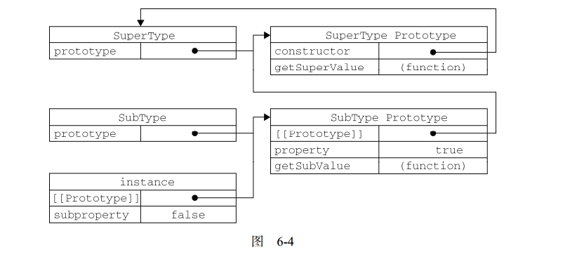

## 原型链

ECMAScript 中描述了原型链的概念，并将原型链作为实现继承的主要方法。其基本思想是利用原型让一个引用类型继承另一个引用类型的属性和方法。

简单回顾一下构造函数、原型和实例的关系：每个构造函数都有一个原型对象，原型对象都包含一个指向构造函数的指针，而实例都包含一个指向原型对象的内部指针。当一个原型对象等于另一个类型的实例，原型对象将包含一个指向另一个原型的指针，相应地，另一个原型中也包含着一个指向另一个构造函数的指针。假如另一个原型又是另一个类型的实例，那么上述关系依然成立，如此层层递进，就构成了实例与原型的链条，亦即原型链。

实现原型链的基本模式

```js
function SuperType(){
    this.prototype = true;
}

SuperType.prototype.getSuperValue = function(){
    return this.property;
};

function SubType(){
    this.subproperty = false;
}

// 继承了 SuperType
SubType.prototype = new SuperType();

SubType.prototype.getSubValue = function(){
    return this.subproperty;
}

let instance = new SubType();
console.log(instance.getSuperValue());		// true
```

上述例子中，SubType 继承了 SuperType，而继承是通过创建 SuperType 的实例，并将实例赋值给 SubType.prototype 实现的。实现的本质是重写原型对象，代之以一个新类型的实例。换句话说，原来存在于 SuperType 的实例中的所有属性和方法，现在也存在于 SubType.prototype 中了。在确立了继承关系之后，我们给 SubType.prototype 添加了一个方法，这样就在继承了 SuperType 的属性和方法的基础上又添加了一个新方法。



SubType 没有使用默认提供的原型，而是把 SuperType 赋值给它。于是，新原型不仅具有作为一个 SuperType 的实例所拥有的全部属性和方法，而且其内部还有一个指针，指向了 SuperType 的原型。

最终结果就是：`instance` 指向 SubType 的原型，SubType 的原型又指向 SuperType 的原型。`getSuperValue()` 方法仍然还在 `SuperType.prototype` 中，但 property 则位于 SubType.prototype 中。这是因为 property 是一个实例属性，而 `getSuperValue()` 则是一个原型方法。既然 SubType.prototype 现在是  SuperType 的实例，那么 property 当然就位于该实例中。此外，要注意 instance.constructor 现在指向的是 SuperType，这是因为原来 SubType.prototype 中的 constructor 被重写了的缘故。

当以读取模式访问一个实例属性时，首先会在实例中搜索该属性。如果没有找到该属性，则会继续搜索实例的原型。在通过原型链实现继承的情下，搜索过程就得以沿着原型链继续向上。在找不到属性或方法的情况下，搜索过程是要一环一环地前行到原型链末端才会停下来。

### 默认的原型

所有引用类型默认都继承于 Object，而这个继承也是通过原型链实现的。所有函数的默认原型都是 Object 的实例，因此默认原型都包含一个内部指针，指向 `Object.prototype`。这也是所有自定义类型都会继承 `toString()`、`valueOf()` 等默认方法的根本原因。

### 确定原型与实例的关系

通过两种方式确定原型与实例的关系：

- `instanceof` 操作符

  ```js
  console.log(instance instanceof Object);	// true
  ```

- `isPropertyOf()` 方法

  ```js
  console.log(Object.property.isPropertyOf(instance));	// true
  ```

### 原型链的问题

包含引用类型的原型属性会被所有实例共享，这也正是为什么在构造函数中，而非在原型对象中定义属性的原因。在通过原型来实现继承时，原型实际上会变成另一个类型的实例。

另一个问题是，在创建子类型的实例时，不能向超类型的构造函数中传递参数。实际上，应该说是没有办法在不影响所有对象实例的情况下，给超类型的构造函数传递参数。

