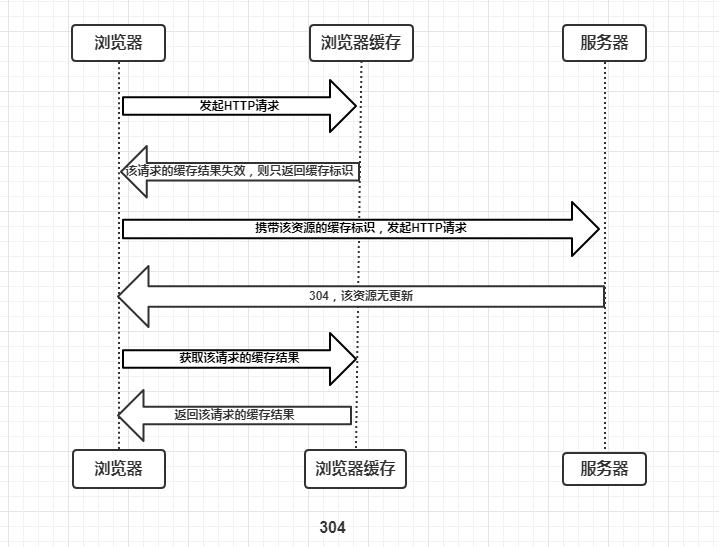
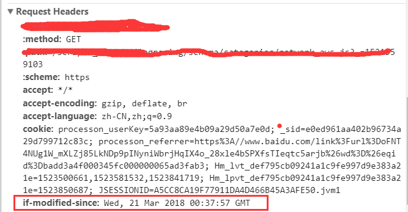
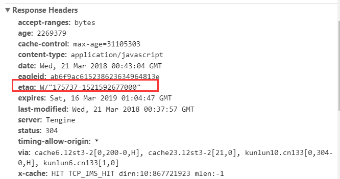
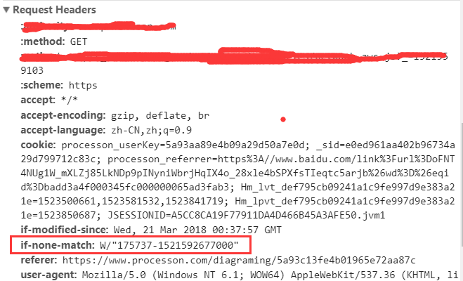

## 浏览器缓存机制

Web 缓存大致可以分为：数据库缓存、服务器缓存（代理服务器缓存、CDN 缓存）、浏览器缓存。因为可能会直接使用副本免于重新发送请求或者仅仅确认资源没变无需重新传输资源实体，Web缓存可以减少延迟加快网页打开速度、重复利用资源减少网络带宽消耗、降低请求次数或者减少传输内容从而减轻服务器压力。

浏览器缓存（Brower Caching）是浏览器在本地磁盘对用户最近请求过的文档进行存储，当访问者再次访问同一页面时，浏览器就可以直接从本地磁盘加载文档。

浏览器缓存也包含很多内容：HTTP 缓存、indexDB、cookie、webstorage 等等。

在具体了解 HTTP 缓存之前先来明确几个术语：

- 缓存命中率：从缓存中得到数据的请求数与所有请求数的比率。理想状态是越高越好。
- 过期内容：超过设置的有效时间，被标记为“陈旧”的内容。通常过期内容不能用于回复客户端的请求，必须重新向源服务器请求新的内容或者验证缓存的内容是否仍然准备。
- 验证：验证缓存中的过期内容是否仍然有效，验证通过的话刷新过期时间。
- 失效：失效就是把内容从缓存中移除。当内容发生改变时就必须移除失效的内容。

### 浏览器缓存过程分析

浏览器与服务器通信的方式为应答模式，即是：**浏览器发起HTTP请求 – 服务器响应该请求**。那么浏览器第一次向服务器发起该请求后拿到请求结果，会根据响应报文中 HTTP 头的缓存标识，决定是否缓存结果，是则将请求结果和缓存标识存入浏览器缓存中，简单的过程如下图：

由上图我们可以知道：

- 浏览器每次发起请求，都会先在浏览器缓存中查找该请求的结果以及缓存标识
- 浏览器每次拿到返回的请求结果都会将该结果和缓存标识存入浏览器缓存中

以上两点结论就是浏览器缓存机制的关键，他确保了每个请求的缓存存入与读取，只要我们再理解浏览器缓存的使用规则，那么所有的问题就迎刃而解了，本文也将围绕着这点进行详细分析。为了方便大家理解，这里我们根据是否需要向服务器重新发起HTTP请求将缓存过程分为两个部分，分别是**强制缓存**和**协商缓存** 。

### HTTP头信息控制缓存

大致分为两种：强缓存和协商缓存。强缓存如果命中缓存不需要和服务器端发生交互，而协商缓存不管是否命中都要和服务器端发生交互，强制缓存的优先级高于协商缓存。具体内容下文介绍。

**强缓存和协商缓存的区别**

|          | 状态码 | 获取资源形式                               |
| -------- | ------ | ------------------------------------------ |
| 强缓存   | 200    | 否，直接从缓存取                           |
| 协商缓存 | 304    | 是，正如其名，通过服务器来告知缓存是否可用 |

#### 强缓存

**强制缓存就是向浏览器缓存查找该请求结果，并根据该结果的缓存规则来决定是否使用该缓存结果的过程**。强制缓存的情况主要有三种（暂不分析协商缓存过程）。

- 不存在该缓存结果和缓存标识，强制缓存失效，则直接向服务器发起请求（跟第一次发起请求一致）

- 存在该缓存结果和缓存标识，但该结果已失效，强制缓存失效，则使用协商缓存（暂不分析）

- 存在该缓存结果和缓存标识，且该结果尚未失效，强制缓存失效，直接返回该结果

**强制缓存的缓存规则是什么？**

当浏览器向服务器发起请求时，服务器会将缓存规则放入 HTPP 响应报文的 HTTP 头中和请求结果一起返回给浏览器，控制强制缓存的字段分别是 Expires 和 Cache-Control，其中 Cache-Control 优先级比 Expires 高。

强制缓存的过期时间通过第一次访问服务器时返回的响应头获取。在 HTTP/1.0 和 HTTP/1.1 版本中通过不同的响应头字段实现。

##### Pragma

`Pragma` 是 HTTP/1.1 之前版本遗留的通用首部字段，仅作为于 HTTP/1.0 的向后兼容而使用。虽然它是一个通用首部，但是它在响应报文中时的行为没有规范，依赖于浏览器的实现。RFC 中该字段只有 `no-cache` 一个可选值，会通知浏览器不直接使用缓存，要求向服务器发请求校验新鲜度。因为它优先级最高，当存在时一定不会命中强缓存。

##### HTTP/1.0 Expires

在 HTTP/1.0 版本中，强制缓存通过 Expires 响应头来实现。 Expires 的值为 GMT 格式的时间字符串，表示资源过期失效的时间，在该时间之前，浏览器始终使用强缓存。

- 也就是说，当发起请求的时间超过了 Expires 设定的时间，即表示资源缓存时间到期，会发送请求到服务器重新获取资源。
- 而如果发起请求时客户端的时间在 Expires 限定的时间之内，浏览器会直接读取**本地缓存数据库**中的信息（`from memory` 或 `from disk`），两种方式根据浏览器的策略随机获取。

Expires 控制缓存的原理是使用客户端的时间与服务端返回的时间做对比，那么如果客户端与服务端的时间因为某些原因（例如时区不同；客户端和服务的有一方的时间不准确）发生误差，那么强制缓存则会直接失效，这样的话强制缓存的存在则毫无意义，因此到了 HTTP/1.1，Expires 被 Cache-Control 替代。

##### HTTP/1.1 Cache-Control

在 HTTP/1.1 版本中，强制缓存通过 Cache-Control 响应头来实现。Cache-Control 拥有多个值：

| Cache-directive                     | 说明                                                         |
| ----------------------------------- | ------------------------------------------------------------ |
| public                              | 所有内容都将被缓存（客户端和代理服务器都可缓存）             |
| private（默认）                     | 内容只缓存到私有缓存中（仅客户端可以缓存，代理服务器不可缓存） |
| no-cache                            | 必须先与服务器确认返回的响应是否被更改，然后才能使用该响应来满足后续对同一个网址的请求。因此，如果存在合适的验证令牌（ETag），no-cache 会发起往返通信来验证缓存的响应，如果资源未被更改，可以避免下载。 |
| no-store                            | 所有内容都不会被缓存到缓存或 Internet 临时文件中，既不使用强制缓存，也不使用协商缓存 |
| must-revlidation/proxy-revalidation | 如果缓存的内容失效，请求必须发送到服务器/代理以进行重新验证  |
| max-age=xxx（xxx is numeric）       | 缓存的内容将在 xxx 秒后失效, 这个选项只在HTTP 1.1可用, 并如果和Last-Modified一起使用时, 优先级较高 |

最常用的字段就是 max-age ，该字段为一个键值对，值为一个相对时间，如 `Cache-Control: max-age=600` ，代表该资源缓存的有效时间为60秒，60秒之内使用强制缓存。

一般来说，为了兼容，两个版本的强制缓存都会被实现。

由上面的例子我们可以知道：

- HTTP 响应报文中 Expires 的时间值，是一个绝对值
- HTTP 响应报文中 Cache-Control 为 max-age=600，是相对值

由于 Cache-Control 的优先级比 Expires 高，那么直接根据 Cache-Control 的值进行缓存，意思就是说在600秒内再次发起该请求，则会直接使用缓存结果，强制缓存生效。

⚠️ 注意：在无法确定客户端的时间是否与服务端的时间同步的情况下，Cache-Control 相比于 Expires 是更好的选择，所以同时存在时，只有 Cache-Control 生效。

**浏览器的缓存存放在哪里，如何在浏览器中判断强制缓存是否生效？**

这里我们以博客的请求为例，状态码为灰色的请求则代表使用了强制缓存，请求对应的 Size 值则代表该缓存存放的位置，分别为 **from memory cache** 和 **from disk cache**。

**内存缓存（from memory cache）和硬盘缓存（from disk cache）对比**

- **内存缓存（from memory cache）**：内存缓存具有两个特点，分别是**快速读取**和**时效性**：
  - **快速读取**：内存缓存会将编译解析后的文件，直接存入该进程的内存中，占据该进程的内存中，占据该进程一定的内存资源，以便下次运行使用时的快速读取
  - **时效性**：一旦该进程关闭，则该进程的内存则会清空
- **硬盘缓存（from disk cache）**：硬盘缓存则是直接将缓存写入硬盘文件中，读取缓存需要对该缓存存放的硬盘文件进行I/O操作，然后重新解析该缓存内容，读取复杂，速度比内存缓存慢。

在浏览器中，浏览器会在 JavaScript 脚本和图片等文件解析后直接存入内存缓存中，那么刷新页面时只需直接从内存缓存中读取（from memory cache）；而 CSS 文件则会存入硬盘文件中，所以每次渲染页面都需要从硬盘读取缓存（from disk cache）。

##### 总结

强制缓存只有首次请求才会跟服务器通信，读取缓存资源时不会发出任何请求，资源的 Status 状态码为 200，资源的 Size 为 `from memory` 或者 `from disk` ，HTTP1.1 版本的实现优先级会高于 HTTP/1.0 版本的实现。

#### 协商缓存

**协商缓存就是强制缓存失效后，浏览器携带缓存标识向服务器发起请求，由服务器根据缓存标识决定是否使用缓存的过程。**而协商缓存与强制缓存的不同之处在于，协商缓存每次读取数据时都需要跟服务器通信，并且会增加缓存标识。在第一次请求服务器时，服务器会返回资源，并且返回一个资源的缓存标识，一起存到浏览器的缓存数据库。当第二次请求资源时，浏览器会首先将缓存标识发送给服务器，服务器拿到标识后判断标识是否匹配，如果不匹配，表示资源有更新，服务器会将新数据和新的缓存标识一起返回到浏览器；如果缓存标识匹配，表示资源没有更新，并且返回 304 状态码，浏览器就读取本地缓存服务器中的数据。

- 协商缓存生效，返回304

- 协商缓存失效，返回200和请求结果

在 HTTP 协议的 1.0 和 1.1 版本中也有不同的实现方式。

##### HTTP/1.0 Last-Modified/If-Modified-Since

在 HTTP/1.0 版本中，第一次请求资源时服务器通过 Last-Modified 来设置响应头的缓存标识，并且把资源最后修改的时间作为值填入，然后将资源返回给浏览器。在第二次请求时，浏览器会首先带上 If-Modified-Since 请求头去访问服务器，服务器会将 If-Modified-Since 中携带的时间与资源修改的时间匹配，如果时间不一致，服务器会返回新的资源，并且将 Last-Modified 值更新，作为响应头返回给浏览器，状态码为200，响应体 Body 中为修改后的资源内容。如果时间一致，表示资源没有更新，服务器返回 304 状态码，浏览器拿到响应状态码后从本地缓存数据库中读取缓存资源。

这种方式有一个弊端，就是当服务器中的资源增加了一个字符，后来又把这个字符删掉，本身资源文件并没有发生变化，但修改时间发生了变化。当下次请求过来时，服务器也会把这个本来没有变化的资源重新返回给浏览器。

- Last-Modified 是服务器响应请求时，代表该资源文件在服务器最后被修改的时间。

- If-Modified-Since 则是客户端再次发起该请求时，携带上次请求返回的 Last-Modified 值，通过此字段值告诉服务器该资源上次请求返回的最后被修改时间。服务器收到该请求，发现请求头含有 If-Modified-Since 字段，则会根据 If-Modified-Since 的字段值与该资源在服务器的最后被修改时间做对比，若服务器的资源最后被修改时间大于 If-Modified-Since 的字段值，则重新返回资源，状态码为200；否则则返回304，代表资源无更新，可继续使用缓存文件。

##### HTTP/1.1 Etag/If-None-Match

ETag 代表资源的 **内容**，是 Entity Tag（实体标签）的缩写，该值为资源的唯一标识符。HTTP/1.1 协议并没有规范该值如何生成，一般而言为该资源的散列值。当浏览器访问该资源时，服务器会根据资源计算出一个哈希值，并随 ETag 响应头返回，如 `ETag: W/"76601-15ba7b41280"`，当浏览器下次需要访问资源时，携带 `If-None-Match: W/"76601-15ba7b41280"` 请求头，服务器再次计算该资源的 ETag 值，如果没有改变则返回 304，如果改变返回新的资源内容。

- Etag 是服务器响应请求时，返回当前资源文件的一个唯一标识（由服务器生成）。

- If-None-Match 是客户端再次发起该请求时，携带上次请求返回的唯一标识 Etag 值，通过此字段值告诉服务器该资源上次请求返回的唯一标识值。服务器收到该请求后，发现该请求头中含有 If-None-Match，则会根据 If-None-Match 的字段值与该资源在服务器的 Etag 值做对比，一致则返回304，代表资源无更新，继续使用缓存文件；不一致则重新返回资源文件，状态码为200。

⚠️ 注意：Etag / If-None-Match 优先级高于 Last-Modified / If-Modified-Since，同时存在则只有 Etag / If-None-Match 生效。

**Etag 主要为了解决 Last-Modified 无法解决的一些问题。**

1. 一些文件也许会周期性的更改，但是他的内容并不改变（仅仅改变的修改时间），这个时候我们并不希望客户端认为这个文件被修改了；
2. 某些文件修改非常频繁，比如在秒以下的时间内进行修改，(比方说 1 秒内修改了 N 次)，Last-Modified 能检查到的粒度是秒级的，这种修改无法判断（或者说 UNIX 记录 MTIME 只能精确到秒）；
3. 某些服务器不能精确的得到文件的最后修改时间。

总的来说，ETag 是 LastModifed 的补充，比 LastModified 更加严谨。但设定了 Etag 之后，每次客户端发出请求，服务端都会根据资源重新生成一个 ETag，相对来说，对性能会有影响。

##### 用户行为

| 用户操作     | Expires/Cache-Control | Last-Modified/Etag |
| ------------ | --------------------- | ------------------ |
| 地址栏回车   | 有效                  | 有效               |
| 页面链接跳转 | 有效                  | 有效               |
| 新开窗口     | 有效                  | 有效               |
| 前进、后退   | 有效                  | 有效               |
| F5刷新       | 无效                  | 有效               |
| Ctrl+F5刷新  | 无效                  | 无效               |

##### 总结

协商缓存每次请求都会与服务器交互，第一次是拿数据和标识的过程，第二次开始，就是浏览器询问服务器资源是否有更新的过程。每次请求都会传输数据，如果命中缓存，则资源的 Status 状态码为 304 而不是 200 。同样的，一般来讲为了兼容，两个版本的协商缓存都会被实现，HTTP/1.1 版本的实现优先级会高于 HTTP/1.0 版本的实现。

### 浏览器缓存头部字段

| 字段              | 位置          | 说明                                                         | 示例                                            |
| ----------------- | ------------- | ------------------------------------------------------------ | ----------------------------------------------- |
| Pragma            | 响应头        | HTTP/1.0可用，现在为了向下兼容，也设置该头部，只有一个值：`no-cache` 禁用缓存 | `pragma: no-cache`                              |
| Expires           | 响应头        | 设置缓存时间（该时间相对于服务器），接受一个GMT（格林尼治时间），用来告诉浏览器过期时间，如果还没有过这个时间则不发送请求。 | `expires: Sun Jul 15 2018 19:13:07 GMT`         |
| Cache-Control     | 请求头/响应头 | 也可用来设置缓存时间，HTTP/1.1 与 HTTP1.0 可用，三者优先级：Pragma > Cache-Control > Expires。 可设置多个值，比如常用的：no-cache, max-age, public, private。 | `cache-control: no-cache,max-age=600,public`    |
| Last-Modified     | 响应头        | 接受一个格林尼治时间，说明资源的最近一次的修改时间，该字段的作用是当某个资源保存的缓存时间过期了，但服务器并没有更新过这个资源，那么可以告诉客户端此资源没有更新，可以获取缓存中的内容（返回304，不返回实体内容） | `last-modified:  Wed, 12 Sep 2018 10:42:41 GMT` |
| If-Modified-Since | 请求头        | Last-Modified的值会在下一次的请求中通过if-Modified-Since传递给服务器，如果它的值和此时服务器的Last-Modified值一致，说明没有修改，服务器返回304。如果不一致则当作正常请求处理，返回资源和200状态码。 |                                                 |
| ETag              | 响应头        | 服务端资源有可能被更新了，但是实际内容并没有改变。但是这样依然会引起Last-Modified的更新，服务器给客户端返回没有任何改变的内容。为了解决这个问题，引入了ETag。用于http1.1。 服务器为资源生成一个唯一的字符串，如通过md5编码。只要不变，生成的字符串就不变。在客户端请求资源的时候，将该ETag一起返回给客户端，客户端保留该ETag，下次请求的时候带上。然后比较ETag，相同则表示内容相同，返回304；不同，返回资源和200状态码。 | `etag:  W/"69882100f431f70037d406f4f2ad0d99"`   |
| If-None-Match     | 请求头        | ETag的值会通过if-None-Match头部传递给服务器，然后服务器比较ETag的值，相同则表示内容相同，返回304；不同，返回资源和200状态码。 |                                                 |

### 实际应用

回到实际应用上来，首先要明确哪些内容适合被缓存哪些不适合。

考虑缓存的内容：

- CSS 样式文件
- JS 文件
- Logo、图标
- HTML 文件
- 可以下载的内容

一些不应该被缓存的内容：

- 业务敏感的 GET 请求

### 总结

强制缓存优先于协商缓存进行，若强制缓存（Expires和Cache-Control）生效则直接使用缓存，若不生效则进行协商缓存（Last-Modified / If-Modified-Since和Etag / If-None-Match），协商缓存由服务器决定是否使用缓存，若协商缓存失效，那么代表该请求的缓存失效，重新获取请求结果，再存入浏览器缓存中；生效则返回304，继续使用缓存，主要过程如下：

---

参考资料

- [彻底理解浏览器的缓存机制](https://www.cnblogs.com/duiniweixiao/p/8884274.html)
- [ 10分钟彻底搞懂Http的强制缓存和协商缓存](https://segmentfault.com/a/1190000016199807)