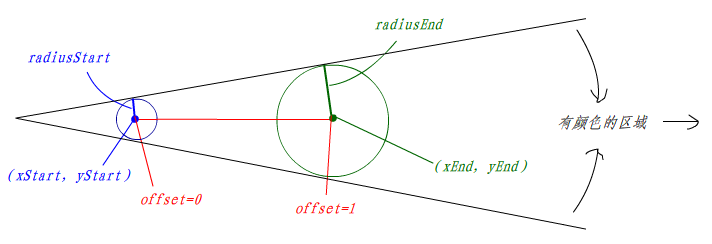

## 渐变

渐变的相关样式属性及方法共有两种，分为线性渐变和径向渐变：

- [createLinearGradient](#createLinearGradient)
- [createRadialGradient](#createRadialGradient)

### createLinearGradient()

`CanvasRenderingContext2D.createLinearGradient()` 方法创建一个沿参数坐标指定的直线的渐变（线性渐变）。该方法返回一个线性 `CanvasGradient` 对象。

#### 语法

```js
CanvasGradient ctx.createLinearGradient(x1, y1, x2, y2);
```

| 参数 | 说明              | 类型   |
| ---- | ----------------- | ------ |
| x1   | 渐变起点的 x 坐标 | number |
| y1   | 渐变起点的 y 坐标 | number |
| x2   | 渐变终点的 x 坐标 | number |
| y2   | 渐变终点的 y 坐标 | number |

通过 `createLinearGradient()` 创建了 `CanvasGradient` 对象，但并没有渐变的颜色，需要通过使用 `CanvasGradient` 对象的唯一一个方法 `addColorStop` 来定义渐变的颜色。

在 Canvas 中线性渐变常见的有三种：水平的线性渐变、垂直的线性渐变和角度的线性渐变。但不管哪种线性渐变，都是依靠起点 `(x1, y1)` 和终点 `(x2, y2)` 来决定：

- 当起点 `x1` 和终点 `x2` 不同时，将会构造出水平的线性渐变
- 当起点 `y1` 和终点 `y2` 不同时，将会构造出垂直的线性渐变
- 当 `x1` 和 `x2` 以及 `y1` 和 `y2` 都不同时，将会构造出角度的线性渐变，这一点和 CSS 不一样，在 Canvas 中并没有类似 `deg` 这样的方法决定角度线性渐变。

#### 示例

```html
<canvas id="canvas"></canvas>
```

```js
const canvas = document.getElementById("canvas");
const ctx = canvas.getContext("2d");

// 创建线性渐变对象
const gradient = ctx.createLinearGradient(0,0,200,0);

 gradient.addColorStop(0, '#E55D87'); 
 gradient.addColorStop(1, '#5FC3E4');

 context.fillStyle = gradient;
 context.fillRect(0, 0, 400, 300);
```

### createRadialGradient()

`CanvasRenderingContext2D.createRadialGradient()` 是 Canvas 2D API 根据参数确定两个圆的坐标，绘制放射性渐变的方法（径向渐变）。该方法返回一个线性 `CanvasGradient` 对象。

#### 语法

```js
CanvasGradient ctx.createRadialGradient(x0, y0, r0, x1, y1, r1);
```

| 参数 | 说明                | 类型   |
| ---- | ------------------- | ------ |
| x1   | 发散开始圆心 x 坐标 | number |
| y1   | 发散开始圆心 y 坐标 | number |
| r1   | 发散开始圆心的半径  | number |
| x2   | 发散结束圆心 x 坐标 | number |
| y2   | 发散结束圆心 y 坐标 | number |
| r2   | 发散结束圆心的半径  | number |

前三个参数描述一个圆（开始圆），后三个参数描述另一个圆（结束圆）。这两个圆本身不仅描述了方向及渐变的起止位置，还描述了渐变的形状。用于描述每个圆有三个参数，`(x,y) `表示圆心位置，`r` 表示圆的半径。

实际的渐变效果时连接两个圆周的锥体，其中开始圆之前的锥体部分显示偏移值 `0` 的颜色，而结束圆之后的锥体部分则显示偏移值为 `1` 的颜色。

实际



#### 示例

##### 基本用法

```html
<canvas id="canvas"></canvas>
```

```js
const canvas = document.getElementById("canvas");
const ctx = canvas.getContext("2d");

// 创建径向渐变对象
const gradient = ctx.createRadialGradient(100,100,100,100,100,0);

gradient.addColorStop(0,"white");
gradient.addColorStop(1,"green");
ctx.fillStyle = gradient;
ctx.fillRect(0,0,200,200);
```

##### 同心圆径向渐变

```html
<canvas id="canvas"></canvas>
```

```js
 const gradient = context.createRadialGradient(200, 150, 0, 200, 150, 200);

 gradient.addColorStop(0.1, '#F09819');
 gradient.addColorStop(1, '#EDDE5D');

 context.fillStyle = gradient;
 context.beginPath();
 context.arc(200, 150, 100, 0, Math.PI * 2, true);
 context.closePath();
 context.fill();
```

##### 不同圆心的径向渐变

```html
<canvas id="canvas"></canvas>
```

```js
 const gradient = context.createRadialGradient(100, 150, 10, 300, 150, 80);
 gradient.addColorStop(0.1, '#F09819');
 gradient.addColorStop(0.8, 'red');
 gradient.addColorStop(1, '#EDDE5D');

 context.fillStyle = gradient;
 context.fillRect(0, 0, 300, 500);
```

### CanvasGradient对象

`CanvasGradient` 接口表示描述渐变的不透明对象。

#### 属性

不透明对象，没有透露的属性。

#### 方法

##### addColorStop()

`CanvasGradient.addColorStop()` 方法添加一个由偏移值和颜色值指定的断点到渐变。如果偏移值不在0到1之间，将抛出 `INDEX_SIZE_ERR` 错误，如果颜色值不能被解析为有效的 CSS 颜色值，将抛出 `SYNTAX_ERR` 错误。

```js
void gradient.addColorStop(offset, color);
```

| 参数   | 说明                                | 类型     |
| ------ | ----------------------------------- | -------- |
| offset | 设定的颜色离渐变结束点的偏移量(0~1) | number   |
| color  | 绘制时要使用的颜色                  | CSSColor |

```html
<canvas id="canvas"></canvas>
```

```js
const canvas = document.getElementById("canvas");
const ctx = canvas.getContext("2d");

const gradient = ctx.createLinearGradient(0,0,200,0);
gradient.addColorStop(0,"green");
gradient.addColorStop(1,"white");
ctx.fillStyle = gradient;
ctx.fillRect(10,10,200,100);
```

---

参考资料：

- <a href='https://segmentfault.com/p/1210000010536257/read#top' target='_blank'>一个少女心满满的例子带你入门 canvas</a>
- <a href='https://www.w3cplus.com/canvas/gradient.html' target='_blank'>Canvas学习：渐变</a>