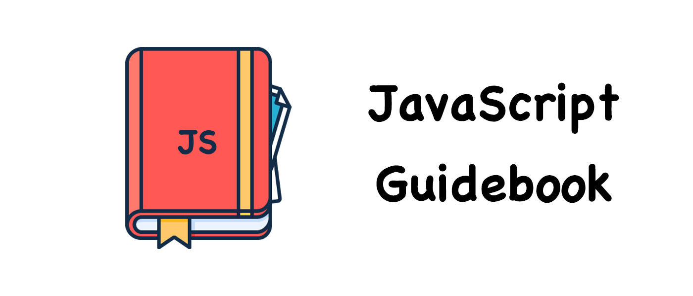

# JavaScript Guidebook

为前端开发者提供完备的系统的技术指南。

指南目录参考各主流前端书籍与 ECMAscript 规范而整合而生。

指南内容大多收集于各大技术社区和博客，由本人整理、补充和校正而成，相应章节均有来源链接，若有遗漏，烦请提出 issue。

**说明**：编写整理过程有不当之处，欢迎 pull requests 或提出 issue

## :spiral_notepad:项目目录

### :beginner:基本语法 Basic Concept

查看目录

- **术语定义**
- **词法语法**
  - [词法语法](basic-concept/lexical-grammar.md)
- **数据类型和值**
  - [数据类型](basic-concept/data-types.md)
- **表达式**
  - **主要表达式**
    - [this 关键字](basic-concept/expression/primaray-expression/this.md)
    - [数组初始化](basic-concept/expression/primaray-expression/array-initializer.md)
    - [字面量引用](basic-concept/expression/primaray-expression/literal.md)
    - [对象初始化](basic-concept/expression/primaray-expression/object-initializer.md)
    - [分组表达式](basic-concept/expression/primaray-expression/the-grouping-operator.md)
    - [属性访问器](basic-concept/expression/primaray-expression/property-accessors.md)
  - [更新表达式](basic-concept/expression/update-expressions.md)
  - **一元运算符**
    - [in](basic-concept/expression/unary-operators/in.md)
    - [instanceof](basic-concept/expression/unary-operators/instanceof.md)
    - [delete](basic-concept/expression/unary-operators/delete.md)
    - [typeof](basic-concept/expression/unary-operators/typeof.md)
    - [void](basic-concept/expression/unary-operators/void.md)
    - [字符串运算符](basic-concept/expression/unary-operators/string-operator.md)
  - [算术运算符](basic-concept/expression/arithmetic-operators.md)
  - [赋值运算符](basic-concept/expression/assignment-operators.md)
  - [按位运算符](basic-concept/expression/bitwise-operators.md)
  - [逗号运算符](basic-concept/expression/comma-operator.md)
  - [比较运算符](basic-concept/expression/comparation-operators.md)
  - [条件运算符](basic-concept/expression/conditional-operators.md)
  - [逻辑运算符](basic-concept/expression/logical-operators.md)
  - [扩展运算符](basic-concept/expression/spread-operator.md)
  - [解构赋值](basic-concept/expression/detructing-assignment.md)
  - [运算符优先级](basic-concept/expression/operators-precedence.md)
- **语句和声明**
  - [块语句](basic-concept/statements-and-declarations/block.md)
  - [声明和变量语句](basic-concept/statements-and-declarations/declarations-and-the-variable-statement.md)
  - [if 语句](basic-concept/statements-and-declarations/the-if-statement.md)
  - **迭代语句**
    - [do-while 语句](basic-concept/statements-and-declarations/iteration-statement/the-do-while-statement.md)
    - [while 语句](basic-concept/statements-and-declarations/iteration-statement/the-while-statement.md)
    - [for 语句](basic-concept/statements-and-declarations/iteration-statement/the-for-statement.md)
    - [for-in 语句](basic-concept/statements-and-declarations/iteration-statement/the-for-in-statement.md)
    - [for-of 语句](basic-concept/statements-and-declarations/iteration-statement/the-for-of-statement.md)
  - [continue 语句](basic-concept/statements-and-declarations/the-continue-statement.md)
  - [break 语句](basic-concept/statements-and-declarations/the-break-statement.md)
  - [return 语句](basic-concept/statements-and-declarations/the-return-statement.md)
  - [switch 语句](basic-concept/statements-and-declarations/the-switch-statement.md)
  - [label 语句](basic-concept/statements-and-declarations/the-label-statement.md)
  - [throw 语句](basic-concept/statements-and-declarations/the-throw-statement.md)
  - [try-catch 语句](basic-concept/statements-and-declarations/the-try-statement.md)

### 🎓标准内置对象 Standard Built-in Objects

查看目录

- **全局对象**
  - **值属性**
    - [Infinity](standard-built-in-objects/the-global-object/value-properties/infinity.md)
    - [NaN](standard-built-in-objects/the-global-object/value-properties/NaN.md)
    - [undefined](standard-built-in-objects/the-global-object/value-properties/undefined.md)
  - **函数属性**
    - [eval()](standard-built-in-objects/the-global-object/function-properties/eval.md)
    - [isFinite()](standard-built-in-objects/the-global-object/function-properties/isFinite.md)
    - [isNaN()](standard-built-in-objects/the-global-object/function-properties/isNaN.md)
    - [parseFloat()](standard-built-in-objects/the-global-object/function-properties/parseFloat.md)
    - [parseInt()](standard-built-in-objects/the-global-object/function-properties/parseInt.md)
    - [decodeURI()](standard-built-in-objects/the-global-object/function-properties/decodeURI.md)
    - [decodeURIComponent()](standard-built-in-objects/the-global-object/function-properties/decodeURIComponent.md)
    - [encodeURI()](standard-built-in-objects/the-global-object/function-properties/encodeURI.md)
    - [encodeURIComponent()](standard-built-in-objects/the-global-object/function-properties/encodeURIComponent.md)
  - 构造函数
- **基本对象**
  - [Object](standard-built-in-objects/fundamental-objects/object-objects/object-objects.md)
    - 对象类型
    - 对象属性操作
    - 对象属性描述符
  - [Function](standard-built-in-objects/fundamental-objects/function-objects/function-objects.md)
    - 函数属性与方法
    - 作为值的函数
    - 函数的内部属性
  - [Boolean](standard-built-in-objects/fundamental-objects/boolean-objects.md)
  - Symbol
  - [Error](standard-built-in-objects/fundamental-objects/error-objects/error-objects.md)
- **数字和日期**
  - [Date](standard-built-in-objects/numbers-objects/date-objects/date-objects.md)
  - [Math](standard-built-in-objects/numbers-objects/math-objects/math-objects.md)
  - [Number](standard-built-in-objects/numbers-objects/number-objects/number-objects.md)
- **字符处理**
  - [String](standard-built-in-objects/text-processing/string-objects/string-objects.md)
  - [RegExp](standard-built-in-objects/text-processing/regexp-objects/regexp-objects.md)
- **索引集合**
  - [Array](standard-built-in-objects/indexed-collections/array-objects/arry-objects.md)
  - [TypedArrays](standard-built-in-objects/indexed-collections/typed-array-objects/typed-array-objects.md)
- **键值集合**
  - [Map](standard-built-in-objects/keyed-collections/map-objects/map-objects.md)
  - [Set](standard-built-in-objects/keyed-collections/set-objects/set-objects.md)
  - WeakMap
  - [WeakSet](standard-built-in-objects/keyed-collections/weak-set-objects/weal-set-objects.md)
- **结构化数据**
  - [ArrayBuffer](standard-built-in-objects/structured-data/array-buffer-objects/array-buffer-objects.md)
  - DataView
  - [JSON](standard-built-in-objects/structured-data/the-json-object/the-json-object.md)
- **控制抽象对象**
  - Iterator
  - GeneratorFunction
  - Generator
  - Promise
- **反射**
  - Reflect
  - Proxy
  - Module Namespace

### :joystick:核心模块 Core Modules

查看目录

- **可执行代码和执行上下文**
  - 编译阶段
    - [作用域](core-modules/executable-code-and-execution-contexts/compilation/scope.md)
    - [词法作用域](core-modules/executable-code-and-execution-contexts/compilation/lexical-scope.md)
    - [函数中的作用域](core-modules/executable-code-and-execution-contexts/compilation/scope-from-functions.md)
    - [函数作用域](core-modules/executable-code-and-execution-contexts/compilation/function-as-scopes.md)
    - [块作用域](core-modules/executable-code-and-execution-contexts/compilation/blocks-as-scopes.md)
    - [声明提升](core-modules/executable-code-and-execution-contexts/compilation/hoisting.md)
    - [作用域闭包](core-modules/executable-code-and-execution-contexts/compilation/closures.md)
  - 执行阶段
    - [执行上下文栈](core-modules/executable-code-and-execution-contexts/execution/execution-context-stack.md)
    - [变量对象](core-modules/executable-code-and-execution-contexts/execution/variable-object.md)
    - [作用域链](core-modules/executable-code-and-execution-contexts/execution/scope-chain.md)
    - [this绑定](core-modules/executable-code-and-execution-contexts/execution/this.md)
    - [执行上下文](core-modules/executable-code-and-execution-contexts/execution/execution-context.md)
- **函数**
  - **函数声明**
    - [函数声明式定义](core-modules/ecmascript-function-objects/function-declarations/function-definitions.md)
    - [箭头函数定义](core-modules/ecmascript-function-objects/function-declarations/arrow-function-definitions.md)
    - [方法定义](core-modules/ecmascript-function-objects/function-declarations/method-definitions.md)
  - **函数参数**
      - [函数参数](core-modules/ecmascript-function-objects/function-arguments/function-parameters.md)
      - [默认参数](core-modules/ecmascript-function-objects/function-arguments/default-parameters.md)
      - [剩余参数](core-modules/ecmascript-function-objects/function-arguments/rest-parameters.md)
  - **函数调用**
      - [方法调用模式](core-modules/ecmascript-function-objects/function-calls/method-invocation-pattern.md)
      - [函数调用模式](core-modules/ecmascript-function-objects/function-calls/function-invocation-pattern.md)
      - [构造器调用模式](core-modules/ecmascript-function-objects/function-calls/constructor-invocation-pattern.md)
      - [间接调用模式](core-modules/ecmascript-function-objects/function-calls/apply-invocation-pattern.md)
    - **函数类型**
      - [构造函数](core-modules/ecmascript-function-objects/function-types/structure-function.md)
      - [类构造函数](core-modules/ecmascript-function-objects/function-types/class-structure-function.md)
      - [惰性函数](core-modules/ecmascript-function-objects/function-types/lazy-function.md)
      - [级联函数](core-modules/ecmascript-function-objects/function-types/cascade-function.md)
      - [回调函数](core-modules/ecmascript-function-objects/function-types/callback-function.md)
      - [高阶函数](core-modules/ecmascript-function-objects/function-types/hight-order-function.md)
      - [函数柯里化](core-modules/ecmascript-function-objects/function-types/function-currying.md)
      - [函数节流](core-modules/ecmascript-function-objects/function-types/throttle.md)
      - [函数防抖](core-modules/ecmascript-function-objects/function-types/debounce.md)
- **类**
  - 类的基本语法
  - 类的继承
- **脚本和模块**
  - 脚本
  - 模块

### :man_factory_worker:面向对象编程 Object Oriented Programming

查看目录

- **创建对象**
  - [工厂模式](object-oriented-programming/object-creation/the-factory-pattern.md)
  - [构造函数模式](object-oriented-programming/object-creation/the-constructor-pattern.md)
  - [原型模式](object-oriented-programming/object-creation/the-prototype-pattern.md)
  - [组合使用构造函数模式和原型模式](object-oriented-programming/object-creation/combination-constructor-and-prototype-pattern.md)
  - [动态原型模式](object-oriented-programming/object-creation/dynamic-prototype-pattern.md)
  - [寄生构造函数模式](object-oriented-programming/object-creation/parastic-constructor-pattern.md)
  - [稳妥构造函数模式](object-oriented-programming/object-creation/durable-constructor-pattern.md)
- **继承**
  - [原型链](object-oriented-programming/inheritance/prototype-chaining.md)
  - [借用构造函数](object-oriented-programming/inheritance/constructor-stealing.md)
  - [组合继承](object-oriented-programming/inheritance/combination-inheritance.md)
  - [原型式继承](object-oriented-programming/inheritance/prototypal-inheritance.md)
  - [寄生式继承](object-oriented-programming/inheritance/parasitic-inheritance.md)
  - [寄生组合式继承](object-oriented-programming/inheritance/parastic-combination-inheritance.md)

### :office:浏览器对象模型 Browser Oject Model

查看目录

- [**Window对象**](browser-object-model/the-window-object/the-window-object.md)
  - 定时器
    - [setInterval](browser-object-model/the-window-object/timers/setInterval.md)
    - [setTimeout](browser-object-model/the-window-object/timers/setTimeout.md)
    - [定时器运行机制](browser-object-model/the-window-object/timers/timers.md)
  - 系统对话框
    - [alert](browser-object-model/the-window-object/system-dialogs/alert.md)
    - [confirm](browser-object-model/the-window-object/system-dialogs/confirm.md)
    - [prompt](browser-object-model/the-window-object/system-dialogs/prompt.md)
  - 视窗尺寸位置
    - [Window视图属性](browser-object-model/the-window-object/window-position/window-view-properties.md)
    - [Screen视图属性](browser-object-model/the-window-object/window-position/screen-view-properties.md)
    - [文档视图和元素视图](browser-object-model/the-window-object/window-position/document-view-and-element-view.md)
    - [元素视图属性](browser-object-model/the-window-object/window-position/element-view-properties.md)
    - [鼠标位置](browser-object-model/the-window-object/window-position/mouse-position.md)
- **Location对象**
  - [Location对象的属性](browser-object-model/the-location-object/the-location-object-properties.md)
  - [Location对象的方法](browser-object-model/the-location-object/the-location-object-methods.md)
- **History对象**
  - [History对象的属性](browser-object-model/the-history-object/the-history-object-properties.md)
  - [History对象的方法](browser-object-model/the-history-object/the-history-object-methods.md)
- **Screen对象**
  - [Screen对象的属性](browser-object-model/the-screen-object/the-screen-object-properties.md)
  - [Screen对象的方法](browser-object-model/the-screen-object/the-screen-object-methods.md)
- **Navigator对象**
  - [Navigator对象的属性](browser-object-model/the-navigator-object/the-navigator-object-properties.md)
  - [Navigator对象的方法](browser-object-model/the-navigator-object/the-navigator-object-methods.md)
- **其他WebAPI**
  - [File对象](browser-object-model/the-other-api/the-file-object.md)
  - [FileList对象](browser-object-model/the-other-api/the-file-list-object.md)
  - [FileReader对象](browser-object-model/the-other-api/the-file-reader-object.md)
  - [FileReaderSync对象](browser-object-model/the-other-api/the-file-sync-object.md)
  - [FormData对象](browser-object-model/the-other-api/the-file-data-object.md)
  - [ProgressEvent对象](browser-object-model/the-other-api/the-progress-event-object.md)
  - [Blob对象](browser-object-model/the-other-api/the-blob-object.md)
  - [URL对象](browser-object-model/the-other-api/the-url-object.md)
  - [Position对象](browser-object-model/the-other-api/the-position-object.md)
- **浏览器缓存**
  - [浏览器缓存机制](browser-object-model/browser-cache/web-cache.md)
  - [HTTP缓存](browser-object-model/browser-cache/http-cache.md)
  - [Cookie](browser-object-model/browser-cache/cookie.md)
  - [WebStorage](browser-object-model/browser-cache/web-storage.md)
- **客户端检测**
  - [客户端检测](browser-object-model/client-detection/client-detection.md)
- **浏览器工作原理**
  - [整体工作流程](browser-object-model/browser-working-principle/overall-workflow.md)
  - [渲染引擎](browser-object-model/browser-working-principle/the-rendering-engine.md)
  - [解析过程](browser-object-model/browser-working-principle/parsing.md)
  - [渲染树构建](browser-object-model/browser-working-principle/render-tree-construction.md)
  - [布局](browser-object-model/browser-working-principle/layout.md)
  - [绘制](browser-object-model/browser-working-principle/painting.md)
  - [回流和重绘](browser-object-model/browser-working-principle/reflow-and-repaint.md)
  - [动态变化和渲染引擎的线](browser-object-model/browser-working-principle/dynamic-changes-and-rendering-engine-threads.md)
  - [CSS2可视模型](browser-object-model/browser-working-principle/css2-visual-module.md)
  - [渲染层合并](browser-object-model/browser-working-principle/composite.md)

### :page_facing_up:文档对象模型Document Oject Model

查看目录

- **文档对象模型**
  - [DOM](document-object-model/dom.md)
  - [DOM API](document-object-model/dom-api.md)
- **节点层次**
  - [节点层次](document-object-model/hierarchy-of-nodes/hierarchy-of-nodes.md)
  - [Node类型](document-object-model/hierarchy-of-nodes/the-node-type.md)
  - [Document类型](document-object-model/hierarchy-of-nodes/the-document-type.md)
  - [Element类型](document-object-model/hierarchy-of-nodes/the-element-type.md)
- **节点访问**
  - [节点访问](document-object-model/nodes-access/nodes-access.md)
  - [节点关系](document-object-model/nodes-access/node-relation.md)
  - [元素遍历](document-object-model/nodes-access/element-traversal.md)
  - [动态集合](document-object-model/nodes-access/dynamic-collection.md)
- **节点操作**
  - [节点创建](document-object-model/nodes-operate/nodes-create.md)
  - [节点操作](document-object-model/nodes-operate/nodes-operate/README.md)
- **脚本化CSS**
  - [查询样式](document-object-model/scripting-css/accessing-element-styles.md)
  - [操作样式](document-object-model/scripting-css/working-with-style-sheets.md)
- **DOM事件流**
  - [事件流](document-object-model/events/event-flow.md)
  - [事件处理程序](document-object-model/events/event-handlers-or-listener.md)
  - [事件对象](document-object-model/events/the-event-object.md)
  - 事件类型
    - [用户界面事件](document-object-model/events/event-types/ui-events.md)
    - [鼠标与滚轮事件](document-object-model/events/event-types/the-mouse-and-dom-mouse-scroll-events)
    - [键盘与文本事件](document-object-model/events/event-types/the-keyboard-and-text-events.md)
  - [事件委托](document-object-model/events/event-delegation.md)

### :keyboard:HTML5脚本编程 Scripting Programing

 
查看目录

- **语义化**
  - [HTML5表单](html5-scripting-programing/semantics/form-inprovements.md)
  - [HTML5新语义元素](html5-scripting-programing/semantics/new-semantic-elements.md)
- **离线与存储**
  - [Service Worker](html5-scripting-programing/offline-and-storage/service-worker.md)
  - 本地存储
    - [Cookie](html5-scripting-programing/browser-cache/cookie.md)
    - [WebStorage](html5-scripting-programing/browser-cache/web-storage.md)
    - [IndexedDB](html5-scripting-programing/offline-and-storage/indexedDB.md)
  - [本地文件应用](html5-scripting-programing/offline-and-storage/local-files-application.md)
- **通信**
  - PostMessage
  - XMLHttpRequestLevel2
  - Server Sent Event
  - WebSocket
  - WebRTC
- **多媒体**
  - 音频
  - 视频
- **图形特效**
  - [Canvas](html5-scripting-programing/multimedia/canvas/README.md)
  - SVG
  - WebGL
- **性能与集成**
  - WebWorkers
  - 拖放API
  - 动画渲染
  - 全屏API
  - 焦点API
- **设备访问**
  - [地理定位](html5-scripting-programing/device-access/geolocation.md)
  - 触控事件
  - [摄录设备](html5-scripting-programing/device-access/camera.md)
  - 摇感装置

### :outbox_tray:服务器端数据传输 Server Related

 
查看目录

- HTTP
  - [HTTP协议](server-related/http/hyper-text-transfer-protocol.md)
  - [HTTP状态码](server-related/http/status-code.md)
- AJAX(XHR)
- Fetch

### 📱移动端Web开发指南

查看目录

- 页面布局
  - [移动端视口](mobile-web-development/layout/viewport.md)
  - [布局形式](mobile-web-development/layout/adaptation.md)
  - 媒体查询
  - 设备适配
  - 页面适配
- 移动设备WebAPI
  - 视频（Video）
  - 音频
  - 媒体流
  - Web Speech
  - Web Audio API
  - 地理定位
  - 陀螺仪
  - 设备震动
  - 电池状态
  - 环境光
  - 网络信息
  - 平台JSSDK
- touch事件

## :pushpin:说明

**关于排版**

指南内容按照 [中文文案排版指北](http://mazhuang.org/wiki/chinese-copywriting-guidelines/) 进行排版，以保证内容的可读性。

**关于参考资料**

- [MDN web docs](https://developer.mozilla.org/en-US/docs/Web/JavaScript)：官方推荐的前端文档

- [ecma-international ecma 262 5.1（英）](http://www.ecma-international.org/ecma-262/5.1/index.html)：ECMAScript 5

- [ECMAScript 6 入门(阮一峰)](http://es6.ruanyifeng.com/)：ECMAScript 6 入门级中文书籍
- [ECMAScript® 2015 Language Specification（ES6英）](http://www.ecma-international.org/ecma-262/6.0/)：ECMAScript 2015 规范文档
- [ECMAScript® 2016 Language Specification（ES7英）](http://www.ecma-international.org/ecma-262/7.0/index.html)：ECMAScript 2016 规范文档
- [ECMAScript® 2017 Language Specification（ES8英）](http://www.ecma-international.org/ecma-262/8.0/index.html)：ECMAScript 2017 规范文档

### License

本作品采用 <a rel="license" href="http://creativecommons.org/licenses/by-nc-sa/3.0/cn/">知识共享署名-非商业性使用-相同方式共享 3.0 中国大陆许可协议</a> 进行许可。