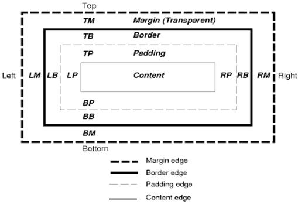

# CSS2 可视化模型

## 画布

根据 CSS2 规范，术语 Canvas 用来描述格式化的结构所渲染的空间——浏览器绘制内容的地方。画布对每个维度空间都是无限大的，但浏览器基于 Viewport 的大小选择了一个初始宽度。

根据 CSS2 规范的定义，画布如果是包含在其他画布内则是透明的，否则浏览器会指定一个颜色。

## 盒模型

CSS 盒模型描述了矩形框，这些矩形框是为文档树中的元素生成的，并根据可视的格式化模型进行布局。

每个盒模型包括内容区域如图片、文本等（content）及可选的四周内填充（padding）、边框（border）和外边距（margin）区域。 



**盒模型又分为 IE 盒模型和 W3C 标准盒模型**

- IE 盒模型：属性 `width`、`height` 包含 `border` 和 `padding`，指的是 `content + padding + border`

```js
width = content-width + padding-width + border-width
height = content-width + padding-height + border-height
```

- W3C 标准盒模型：属性 `width`、`height` 只包含 `content`，不包含 `border` 和 `padding`

```js
width = content-width
height = content-height
```

在 IE8+ 浏览器中使用哪个盒模型可以由 `box-sizing`（CSS3 新增的属性）控制，默认值为 `content-box`，即标准盒模型；如果将 `box-sizing` 设为 `border-box` 则用的是 IE 盒模型。如果在 IE6-8 中 DOCTYPE 缺失会触发 IE 模式。在当前 W3C 标准中盒模型是可以通过 `box-sizing` 自由的进行切换的。

盒模型的布局方式是由以下因素决定的：

- 盒模型的类型
- 盒模型的尺寸
- 定位策略
- 外部信息，例如图片的大小和屏幕大小

### 类型

- 块级元素盒模型 `display: block`
  - `block` 元素会独占一行，多个 `block` 元素会各自新起一行。默认情况下，`block` 元素宽度自动填满其父元素宽度
  - `block` 元素可以设置元素宽高。块级元素即使设置了宽度，仍然是独占一行。
  - 块级元素可以设置外边距 `margin` 和内边距 `padding`
- 行内元素盒模型 `display: inline`
  - 行内元素不会独占一行，多个相邻的行内元素会排列在同一行里，直到一行排列不下，才会新换一行，其宽度随元素的内容而变化
  - 行内元素无法设置宽高
  - 行内元素的外边距 `margin` 和内边距 `padding`，水平方向的 `padding-left`、`padding-right`、`margin-left` 和 `marin-right` 都产生效果；但垂直方向的 `padding-top`、`padding-bottom`、`margin-top` 和 `margin-bottom` 都不会产生效果
- 行内-块级元素盒模型 `display: inline-block`
  - 将对象呈现为行内元素，但是内容为块状元素

## 定位策略

CSS2 可视化模型有三种定位策略：

### 常规文档流

在常规流中，元素框根据在文档中的位置进行定位，也就是说对象在渲染树中的位置和它在 DOM 树中的位置相似，并根据其框类型和尺寸进行布局。。

在块级格式化上下文里面， 它们垂直排列；在行内格式化上下文里面， 它们水平排列。

```css
.foo {
    /* float: none; */
	position: static;
    position: relative;
}
```

### 浮动定位

对于浮动定位方案，元素框称为浮动盒。它位于当前行的开头或末尾。这导致常规文档流环绕在它的周边，除非设置 `clear` 属性。

```js
.foo {
    float: right;
    float: left;
	/* position: static;
    position: relative; */
}
```

### 绝对定位和固定定位

对于绝对定位方案，元素框会脱离常规文档流，不影响常规文档流的布局。 它的定位是相对于包含它的元素框而言的，通过 `top`、`bottom`、`left` 和 `right` 固定位置。

如果元素的属性 `position` 为 `absolute` 或 `fixed`， 它是绝对定位元素。

固定定位元素也是绝对定位元素，它的包含块就是可视区域。当页面滚动时它固定在屏幕上，因为可视区域没有移动。

## 分层展示

这是由 CSS 属性 `z-index` 指定的。它代表了框的第三个维度，也就是沿“z 轴”方向的位置。

这些框分散到多个堆栈（称为堆栈上下文）中。在每一个堆栈中，会首先绘制后面的元素，然后在顶部绘制前面的元素，以便更靠近用户。如果出现重叠，新绘制的元素就会覆盖之前的元素。 

堆栈是按照 `z-index` 属性进行排序的。具有 z-index 属性的元素框形成了本地堆栈。可视区域具有外部堆栈。