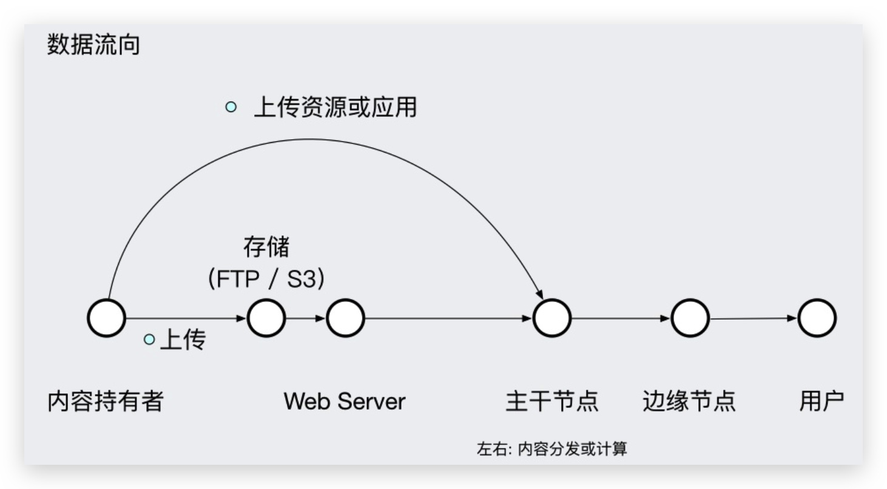

# CDN

內容分发网络（Content delivery network 或 Content distribution network，CDN）通过将源站内容分发至**最接近用户**的节点，从而**降低核心系统负载（系统、网络）**，使用户可就近取得所需内容，**提高用户访问的响应速度**。这种技术方案解决了因分布、带宽、服务器性能带来的访问延迟问题，适用于站点加速、点播、直播等场景。

## 基本原理

尽可能避开互联网上有可能影响数据传输速度和稳定性的瓶颈和环节，使内容传输得更快、更稳定。通过在网络各处放置节点服务器所构成的在现有的互联网基础之上的一层智能虚拟网络，CDN 系统能够实时地根据**网络流量**和**各节点的连接**、**负载状况**以及**到用户的距离**和**响应时间**等综合信息将用户的请求重新导向离用户最近的服务节点上。

利用公式简述 CDN 可表示为：

```js
CDN = 更智能的镜像 + 缓存 + 流量导流
```

简单地说，CDN 是一个经策略性部署的整体系统，包括**分布式存储**、**负载均衡**、**网络请求的重定向**和**内容管理** 4 个要件，而内容管理和全局的网络流量管理（Traffic Management）是 CDN 的核心所在。

## 工作流程

最简单的 CDN 网络由一个 DNS 服务器和几台缓存服务器组成：

1. 当用户点击网站页面上的内容 URL，经过本地 DNS 系统解析，DNS 系统会最终将域名的解析权交给 **CNAME** 指向的 **CDN 专用 DNS 服务器**。
2. CDN 的 DNS 服务器将 CDN 的**全局负载均衡设备 IP 地址**返回用户。
3. 用户向 CDN 的全局负载均衡设备发起内容 URL 访问请求。
4. CDN 全局负载均衡设备会根据用户 IP 地址，以及用户请求的内容 URL，选择一台用户所属区域的**区域负载均衡设备**，告诉用户向这台设备发起请求。
5. 区域负载均衡设备会为用户选择一台合适的**缓存服务器**提供服务，选择的依据包括：根据用户 IP 地址，判断哪一台服务器距用户最近；根据用户所请求的 URL 中携带的内容名称，判断哪一台服务器上有用户所需内容；查询各个服务器当前的负载情况，判断哪一台服务器尚有服务能力。基于以上这些条件的综合分析之后，区域负载均衡设备会向全局负载均衡设备返回一台缓存服务器的 IP 地址。
6. 全局负载均衡设备把服务器的 IP 地址返回给用户。
7. 用户向缓存服务器发起请求，缓存服务器响应用户请求，将用户所需内容传送到用户终端。如果这台缓存服务器上并没有用户想要的内容，而区域均衡设备依然将它分配给了用户，那么这台服务器就要向它的**上一级缓存服务器**请求内容，直至追溯到网站的源服务器将内容拉到本地。


**CDN 切面**


**CDN 数据流向**



## 组成部分

典型的 CDN 系统由下面三个部分组成：

### 分发服务系统

最基本的工作单元就是 Cache 设备，Cache（边缘 Cache）负责直接响应最终用户的访问请求，把缓存在本地的内容快速地提供给用户。同时 Cache 还负责与源站点进行内容同步，把更新的内容以及本地没有的内容从源站点获取并保存在本地。Cache 设备的数量、规模、总服务能力是衡量一个 CDN 系统服务能力的最基本的指标

### 负载均衡系统

主要功能是负责对所有发起服务请求的用户进行访问调度，确定提供给用户的最终实际访问地址。两级调度体系分为全局负载均衡（GSLB）和本地负载均衡（SLB）。GSLB 主要根据用户就近性原则，通过对每个服务节点进行”最优“判断，确定向用户提供服务的 Cache 的物理位置。SLB 主要负责节点内部的设备负载均衡

### 运营管理系统

分为运营管理和网络管理子系统，负责处理业务层面的与外界系统交互所必须的收集、整理、交付工作，包含客户管理、产品管理、计费管理、统计分析等功能。

## 主要特点

### 全网覆盖

CDN 实现了跨运营商、跨地域的全网覆盖。

互联不互通、区域 ISP 地域局限、出口带宽受限制等种种因素都造成了网站的区域性无法访问。CDN 加速可以覆盖全球的线路，通过和运营商合作，部署 IDC 资源，在全国骨干节点商，合理部署 CDN 边缘分发存储节点，充分利用带宽资源，平衡源站流量。

### 远程加速

远程访问用户根据 DNS 负载均衡技术，智能自动选择缓存服务器，选择最快的缓存服务器，加快远程访问的速度。

### 集群抗攻击

广泛分布的 CDN 节点加上节点之间的智能冗余机制，有效地预防黑客入侵以及降低各种 DDoS 攻击对网站的影响，同时保证较好的服务质量。

### 异地备援

当某个服务器发生意外故障时，可以调用其他临近的健康服务器节点进行服务，进而提供接近 100% 的可靠性，这就让你的网站可以做到永不宕机。

### 带宽优化

自动生成服务器的远程 Mirror（镜像）缓存服务器，远程用户访问时从缓存服务器上读取数据，减少远程访问的带宽、分担网络流量、减轻原站点 Web 服务器负载等功能。

## 常见用法

* 源站负责内容生产
* 主干节点负责二级缓存和加速，通常在 BGP 网络

广义上的内容分发网络可以包含源站一起，甚至多媒体分发（视频）

商业意义上的 CDN 只包含 CDN 提供商的网络，不包含源站

部分 CDN 支持图片及多媒体处理扩展等附加功能：压缩、剪切、水印、鉴黄。

## 适用场景

### 网站站点/应用加速

站点或者应用中大量静态资源的加速分发，建议将站点内容进行动静分离，动态文件可以结合云服务器 ECS，静态资源如各类型图片、HTML、CSS、JavaScript 文件等，建议结合对象存储 OSS 存储海量静态资源，可以有效加速内容加载速度，轻松搞定网站图片、短视频等内容给你分发。

### 视频点播/大文件下载分发加速

支持各类文件的下载、分发，支持在线点播加速业务，如 MP4、FLV 视频文件或者平均单个文件大小在 20M 以上，主要的业务场景是视音频点播、大文件下载（如安装包下载）等，建议搭配对象存储 OSS 使用，可提升回源速度，节约 2/3 回源带宽成本。

### 视频直播加速

视频流媒体直播服务，支持媒资存储、切片转码、访问鉴权、内容分发加速一体化解决方案。结合弹性伸缩服务，及时调整服务器带宽，应对突发访问流量；结合媒体转码服务，享受高速稳定的并行转码，且任务规模无缝扩展。

### 移动应用加速

移动 APP 更新文件（APK 文件）分发，移动 APP 内图片、页面、短视频、UGC 等内容的优化加速分发。提供 HTTP DNS 服务，避免 DNS 劫持并获得实时精准的 DNS 解析结果，有效缩短用户访问时间，提升用户体验。

## 最佳实践

* 定义合适的 key 和 secondary key
* 为不同的资源设定合理的过期策略
* 使用带版本号的 URL
* 慎用刷新缓存，只用来删除资源
* 持续优化

## CDN 提供商

每个 CDN 服务提供商的配置信息不同。

* [阿里云](https://www.aliyun.com/product/cdn)
* [腾讯云](https://cloud.tencent.com/product/cdn)
* [华为云](https://www.huaweicloud.com/product/cdn.html)
* [七牛云](https://www.qiniu.com/products/fusion)

---

**参考资料**

* [📖 维基百科：内容分发网络](https://zh.wikipedia.org/wiki/%E5%85%A7%E5%AE%B9%E5%82%B3%E9%81%9E%E7%B6%B2%E8%B7%AF)
* [📝 CDN 的基本工作过程](http://book.51cto.com/art/201205/338756.htm)
* [📝 CDN 知识详解](https://zhuanlan.zhihu.com/p/28939811)
* [📝 HTTP 缓存与 CDN 缓存配置指南](http://dopro.io/http-cache-and-cdn-cache.html)
* [📝 江湖失传的最后一份 CDN 秘籍](https://zhuanlan.zhihu.com/p/31167721?group_id=915177705310674944)
* [📝 CDN HTTPS 安全加速基本概念、解决方案及优化实践](https://juejin.im/post/59f9538f6fb9a0450a66aa2b)
* [📝 面向前端的 CDN 原理介绍](https://github.com/renaesop/blog/issues/1)