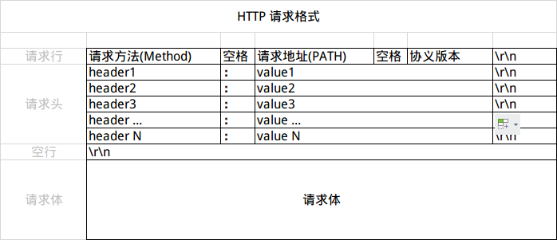
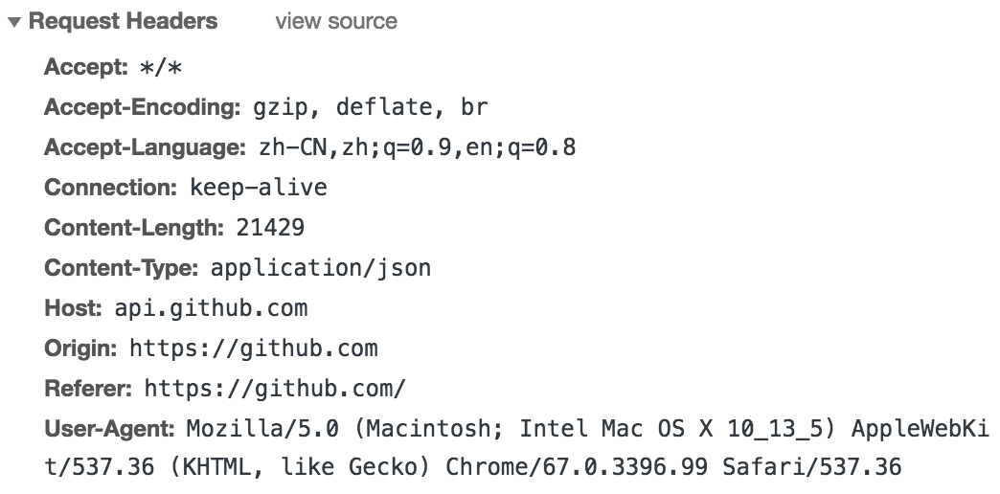
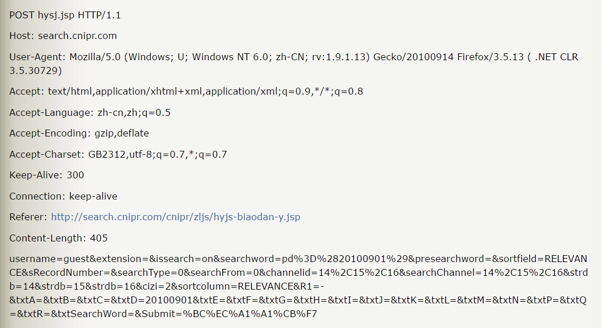
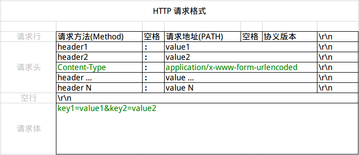

# HTTP 超文本传输协议

## HTTP协议

### 概述

HTTP 全称是 `HyperText Transfer Protocal` ，即：**超文本传输协议**，从 1990 年开始就在 WWW 上广泛应用，是现今在 WWW 上应用最多的协议，HTTP 是应用层协议，当你上网浏览网页的时候，浏览器和 web 服务器之间就会通过 HTTP 在 Internet 上进行数据的发送和接收。HTTP 是一个基于请求/响应模式的、无状态的协议。即我们通常所说的 Request/Response。

### 特点

- 支持客户端/服务器模式
- 简单快速：客户向服务器请求服务时，只需传送请求方法和路径。由于 HTTP 协议简单，使得 HTTP 服务器的程序规模小，因而通信速度很快
- 灵活：HTTP 允许传输任意类型的数据对象。正在传输的类型由 Content-Type 加以标记
- 无连接：无连接的含义是限制每次链接只处理一个请求。服务器处理完客户的请求，并收到客户的应答后，即断开链接，采用这种方式可以节省传输时间
- 无状态：HTTP 协议是无状态协议。无状态是指协议对于事物处理没有记忆能力。缺少状态意味着如果后续处理需要前面的信息，则它必须重传，这样可能会导致每次连接传送的数据量增大。另一方面，在服务器不需要先前信息时它的应答就比较快

## URL详解

### 简介

URL（Uniform Resource Locator）是统一资源定位符的简称，有时候也被俗称为网页地址（网址），如同是网络上的门牌，是因特网上标准的资源的地址。

### 基本组成

通用的格式：`scheme://host[:port#]/path/…/[?query-string][#anchor]`

| 名称         | 功能                                                         |
| ------------ | ------------------------------------------------------------ |
| scheme       | 访问服务器以获取资源时要使用哪种**协议**（例如 http、https 和 FTP 等） |
| host         | HTTP 服务器的 IP 地址或**域名**                              |
| port#        | HTTP 服务器的默认端口为80，这种情况下端口可以省略，如果使用了别的端口，必须指明 |
| path         | 访问资源的**路径**                                           |
| query-string | 发给 HTTP 服务器的数据（**查询参数**）                       |
| anchor       | **锚点**                                                     |

例子

`https://www.baidu.com/m/test/search?keyword=hahh&name=true#stuff`

| 名称         | 对应的字段               |
| ------------ | ------------------------ |
| Shema        | `http`                   |
| host         | `www.baidu.com`          |
| path         | `/m/test/search`         |
| Query-string | `keyword=hahh&name=true` |
| anchor       | `stuff`                  |

## HTTP请求篇

HTTP 的请求报文分为三个部分：**请求行**、**请求头**和**请求体**。

### 请求行

请求行（Request line）分为三个部分：**请求方法**、**请求地址**和**协议版本**

#### 请求方法

HTTP/1.1 协议中共定义了八种方法（也叫“动作”）来以不同的方式操作指定的资源。

| 方法名  | 功能                                                         |
| ------- | ------------------------------------------------------------ |
| GET     | 向指定的资源发出“显示”请求，使用 GET 方法应该只用在读取数据上，而不应该用于产生“副作用”的操作中。 |
| POST    | 指定资源提交数据，请求服务器进行处理（例如提交表单或者上传文件）。数据被包含在请求文本中。这个请求可能会创建新的资源或者修改现有资源，或两者皆有。 |
| PUT     | 向指定资源位置上传其最新内容。                               |
| DELETE  | 请求服务器删除 Request-URI 所标识的资源。                    |
| OPTIONS | 使服务器传回该资源支持的所有 HTTP 请求方法。用 `*` 来代替资源名称，向 Web 服务器发送 OPTIONS 请求，可以测试服务器功能是否正常运作。 |
| HEAD    | 与 GET 方法一样，都是向服务器发出指定资源的请求，只不过服务器将不传回资源的本文部分，它的好处在于，使用这个方法可以在不必传输全部内容的情况下，就可以获取其中 `关于该资源的信息`（原信息或称元数据）。 |
| TRACE   | 显示服务器收到的请求，主要用于测试或诊断。                   |
| CONNECT | HTTP/1.1 中预留给能够将连接改为通道方式的代理服务器。通常用于 SSL 加密服务器的链接（经由非加密的 HTTP 代理服务器）。 |

其中，最常见的是 GET 和 POST 方法，如果是 RESful 接口的话一般会用到 PUT、DELETE、GET、POST（分别对应增删查改），这里附上一篇有关 REST 的文章 [什么是 REST](https://github.com/astaxie/build-web-application-with-golang/blob/master/zh/08.3.md) 

#### 请求头

请求头可用于传递一些附加信息，格式为：`键: 值`，注意**冒号后面有一个空格**： 

**请求和响应常见通用的 Header**

| 名称             | 作用                                                         |
| ---------------- | ------------------------------------------------------------ |
| Content-Type     | 请求体/响应体的类型（如： `text/plain` `application/json`）  |
| Accept           | 说明接收的数量，可以多个值，用英文符号 `,` 分开              |
| Content-length   | 请求体/响应体的长度，单位字节                                |
| Content-Encoding | 请求体/响应体的编码格式（如： `gzip` `deflate`）             |
| Accept-Encoding  | 告知对方我方接受的 Content-Encoding                          |
| ETag             | 给当前资源的标识，和 `Last-Modified` `If-None-Match` `If-Modified-Since` 配合，用于缓存控制 |
| Cache-Control    |                                                              |

**常见的请求 Header**

| 名称              | 作用                                                         |
| ----------------- | ------------------------------------------------------------ |
| Authorization     | 用于设置身份认证信息                                         |
| User-Agent        | 用户标识（如：OS 和浏览器的类型和版本）                      |
| If-Modified-Since | 值为上一次服务器返回的 `Last-Modified` 值，用于确定某个资源是否被更改过，没有更改过就从缓存中读取 |
| If-None-Match     | 值为上一次服务器返回的 ETag 值，一般会和`If-Modified-Since`  |
| Cookie            | 已有的 Cookie                                                |
| Referer           | 标识请求引用自哪个地址，比如你从页面 A 跳转到页面 B 时，值为页面 A 的地址 |
| Host              | 请求的主机和端口号                                           |

#### 请求体

请求体（又叫请求正文）是 POST 请求方式中的请求参数，以 `key = value` 形式进行存储，多个请求参数之间用 `&` 连接，如果请求当中请求体，那么在请求头当中的 Content-Length 属性记录的就是该请求体的长度。

**根据应用场景的不同，HTTP 请求的请求体有三种不同的形式。**

第一种：

移动开发者常见的，请求体是任意类型的，服务器不会解析请求体，请求体的处理需要自己解析，如 POST JSON 的时候就是这类。

第二种：

第二种和第三种都有固定的格式，是服务器端开发人员最先了解的两种。这里的格式要求就是 URL 中 Query String 的格式要求：多个键值对之间用 `&` 连接，键与值之间用 `=` 连接，且只能用 ASCII 字符，非 ASCII 字符需使用 `UrlEncode` 编码。

第三种：

第三种请求体被分成多个部分，**文件上传** 时会被使用，这种格式最先是被用于邮件传输中，每个字段/文件都被 boundary（Content-Type中指定的）分成单独的段，每段以 `--` 加 boundary 开头，然后是该段的描述头，描述头之后空一行接内容，请求结束的标识为 boundary 后面加 `--`

区分是否被当成文件的关键是 `Content-Disposition` 是否包含 `filename`，因为文件有不同的类型，所以还要使用 `Content-Type` 指示文件的类型，如果不知道是什么类型取值可以为 `application/octet-stream` 表示文件是一个二进制的文件，如果不是文件则 `Content-Type` 可以省略。

## HTTP之响应篇

HTTP 响应的格式上除状态行（第一行）与请求报文的请求行不一样之外，其他的就格式而言是一样的，但排除状态行和请求行的区别，从 Header 上还是可以区分出 HTTP 请求和 HTTP 响应的区别的，怎么区别就要看前面的 Header。

### 响应状态行

#### 状态码

状态码（就是上图中的响应码），如果想查看各种状态码具体的含义，可以看一下这篇文章[HTTP状态码](../StatusCode.md)，当然这么多状态码要想全部都记住的话，还是比较困难的。 

| 状态码 | 对应信息                                                     |
| ------ | ------------------------------------------------------------ |
| 1XX    | 提示信息—表示请求已接收，继续处理                            |
| 2XX    | 用于表示请求已被成功接收、理解、接收                         |
| 3XX    | 用于表示资源（网页等）被永久转移到其它 URL，也就是所谓的重定向 |
| 4XX    | 客户端错误—请求有语法错误或者请求无法实现                    |
| 5XX    | 服务器端错误—服务器未能实现合法的请求                        |

#### 响应头

响应头同样可用于传递一些附加信息。

常见的响应 Header

| 名称              | 作用                                                         |
| ----------------- | ------------------------------------------------------------ |
| Date              | 服务器的日期                                                 |
| Last-Modified     | 该资源最后被修改的时间                                       |
| Transfer-Encoding | 取值一般为 chunked，出现在 Content-Length 不能确定的情况下，表示服务器不知道响应板体的数据大小，一般同时出现 `Content-Encoding` 响应头 |
| Set-Cookie        | 设置 Cookie                                                  |
| Location          | 重定向到另一个 URL                                           |
| Server            | 后台服务器                                                   |

#### 响应体

响应体也就是网页的正文内容，一般在响应头中会用 Content-Length 来明确响应体的长度，便于浏览器接收，对于大数据量的正文信息，也会使用 chunked 的编码方式。