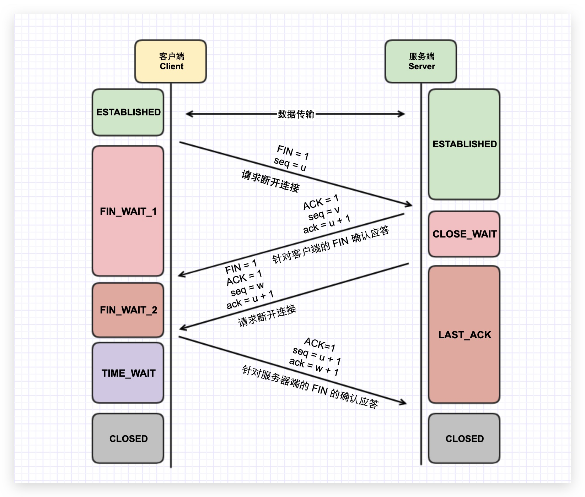

# 传输层协议

网络协议族中有两个具有代表性的传输层协议，分别是 TCP 和 UDP。

## TCP

**传输控制协议**（Transmission Control Protocol，TCP）是一种面向连接（连接导向）的、可靠的、 基于 IP 协议的传输层协议。

### 标志比特位

TCP 首部标志比特有 6 个：URG、ACK、PSH、RST、SYN、FIN

* **URG**：紧急指针
* **ACK**：确认序号有效
* **PSH**：尽可能快地将数据送往接收进程
* **RST**：重建连接
* **SYN**：同步序号来发起一个连接
* **FIN**：发送方完成发送任务

### 三次握手

TCP 提供面向有连接的通信传输。面向有连接是指在数据通信开始之前先做好两端之间的准备工作。

三次握手是指建立一个 TCP 连接时需要客户端和服务器端总共发送三个包以确认连接的建立。在 Socket 编程中，这一过程由客户端执行 connect 来触发。

**三次握手流程图**

1. **第一次握手**：客户端将标志位 SYN 置为 1，随机产生一个值 `seq = X`（由操作系统动态随机选取一个 32 位长的序列号，通常为 0），并将该数据包发送给服务器端，客户端进入 `SYN_SENT` 状态，等待服务器确认
2. **第二次握手**：服务端收到数据包后由标志位 `SYN = 1` 知道客户端**希望请求建立连接**，服务端将标志位 SYN 和 ACK 都置为 1，`ack = X+1`（第一次握手中的 seq 值递加 1），`seq=Y`（由操作系统动态随机选取一个 32 位长的序列号，这里通常为 0），设置以下首部标志后将该数据包发送给客户端**以确认建立连接请求**，服务端进入 `SYN_RCVD` 状态。
3. **第三次握手**：客户端收到确认后，检查 `ack` 是否为 `1`，如果正确则将标志位 `ACK` 置为 1，`ack=Y+1`（第二次握手的 seq 值递加 1），`seq=X+1`（第二次握手中的 ack 值），并将数据包发送给服务器端，服务器端检查 `ack` 是否为 `K+1`，`ACK` 是否为 1，如果正确则连接建立成功，客户端和服务器端进入 ESTABLISHED 状态，完成三次握手，随后客户端与服务器端之间可以开始传输数据了。

握手过程中传送的包里不包含数据，只有三次握手完毕后，客户端与服务器才正式开始传送数据。理想状态下，TCP 连接一旦建立，在通信双方中的任何一方主动关闭连接之前，TCP 连接都将被一直保持下去。

**为什么建立 TCP 连接需要三次握手？**

如果只进行一次握手，无法确认双方的情况，因此建立连接必然两次起步。

**三次握手中的第一次握手可以携带数据吗？**

不可以，因为三次握手还没完成。

**第三次握手可以发送数据吗？为何？**

可以。因为能够发出第三次握手报文的主机，肯定接收到第二次（来自服务端）的握手报文。因为伪造 IP 的主机不会收到第二次报文。

**对方难道不可以将数据缓存下来，等握手成功后再提交给应用程序？**

这样会放大 SYN FLOOD 攻击。如果攻击者伪造了成千上万的握手报文，携带了 1K+ 字节的数据，而接收方会开辟大量的缓存来容纳这些巨大数据，内存会很容易耗尽，从而拒绝服务。

### 四次挥手

四次挥手即终止 TCP 连接，就是指断开一个 TCP 连接时，需要客户端和服务端总共发送 4 个包以确认连接的断开。在 Socket 编程中，这一过程由客户端或服务端任一方执行 close 来触发。

由于 TCP 连接是全双工的，因此，每个方向都必须要**单独进行关闭**，这一原则是当一方完成数据发送任务后，发送一个 FIN（Finish） 来终止这一方向的连接，收到一个 FIN 只是意味着这一方向上没有数据流动了，即不会再收到数据了，但是在这个 TCP 连接上仍然能够发送数据，直到这一方向也发送了 FIN。首先进行关闭的一方将执行主动关闭，而另一方则执行被动关闭。

**四次挥手流程图**

1. **第一次挥手**：客户端发送一个 FIN=1 数据包，用于关闭客户端到服务器端的数据传送，客户端进入 `FIN_WAIT_1` 状态。意思是说"我客户端没有数据要发给你了"，但是如果你服务器端还有数据没有发送完成，则不必急着关闭连接，可以继续发送数据。
2. **第二次挥手**：服务器端收到 FIN 后，先发送 `ack = u+1`，告诉客户端，你的请求我收到了，但是我还没准备好，请继续你等我的消息。这个时候客户端就进入 `FIN_WAIT_2` 状态，继续等待服务器端的 FIN 报文。
3. **第三次挥手**：当服务器端确定数据已发送完成，则向客户端发送 `FIN = N` 报文，告诉客户端，好了，我这边数据发完了，准备好关闭连接了。服务器端进入 `LAST_ACK` 状态。
4. **第四次挥手**：客户端收到 `FIN = N` 报文后，就知道可以关闭连接了，但是他还是不相信网络，怕服务器端不知道要关闭，所以发送 `ack = w+1` 后进入 `TIME_WAIT` 状态，如果服务端端没有收到 ACK 则可以重传。服务器端收到 ACK 后，就知道可以断开连接了。客户端等待了 2MSL 后依然没有收到回复，则证明服务器端已正常关闭，那好，我客户端也可以关闭连接了。最终完成了四次握手。

* 第一次挥手是**服务端确认客户端需要断开连接**
* 第二次挥手是**客户端确认服务器接收断开请求**
* 第三次挥手是**客户端确认服务器数据发完，断开连接**
* 第四次挥手是**服务端确认客户端断开连接，断开连接**

所以如果服务端的数据全部发送完，是没有第三次挥手，直接进入第四次挥手。

**为什么断开 TCP 连接需要四次挥手？**

全双工的通信方式，发送方和接收方都需要一个 FIN 和 ACK 报文。相较于 TCP 的建立，TCP 的关闭时需要释放两端的资源（发送未完成的数据），因此多一个对端的 FIN 的状态

**为什么基于 TCP 的程序往往都有个应用层的心跳检测机制？**

TCP 建立链接后，只是在两端的内核里面维持 TCP 信息，实际上并没有一个物理的连接通路，对端这个时候挂了，谁也不知道。

### SYN FLOOD 攻击

攻击原理：

* 利用 TCP 协议缺陷发送大量伪造的 TCP 连接请求，从而使得被攻击方资源耗尽（CPU 满负荷或内存不足）的攻击方式。
* 第二次握手时候会出现：SYN Timeout，一个用户向服务器发送了 SYN 报文后突然死机或掉线，服务器等待 SYN，ACK。

## UDP

用户数据报协议（英语：User Datagram Protocol，UDP），又称使用者资料包协定，是一个简单的面向数据报的传输层协议，正式规范为 RFC 768。在 TCP/IP 模型中，UDP 为网络层以上和应用层以下提供了一个简单的接口。UDP 只提供数据的不可靠传递，它一旦把应用程序发给网络层的数据发送出去，就不保留数据备份（所以 UDP 有时候也被认为是不可靠的数据报协议）。UDP 在 IP 数据报的头部仅仅加入了复用和数据校验（字段）。

**优点**

* 无需建立连接（减少延迟）
* 实现简单：无需维护连接状态
* 头部开销小（最小值为 8byte）
* 没有拥塞控制：应用可以更好的控制发送时间和发送速率

**基于 UDP 协议的有：**

* 域名系统（DNS）
* 简单网络管理协议（SNMP）
* 动态主机配置协议（DHCP）
* 路由信息协议（RIP）
* 自举协议（BOOTP）
* 简单文件传输协议（TFTP）

---

**参考资料：**

* [📝 一篇文章带你熟悉 TCP/IP 协议](https://juejin.im/post/5a069b6d51882509e5432656)
* [📝 前端必须懂的计算机网络知识](https://juejin.im/post/5ba3b68c6fb9a05d287345ab)