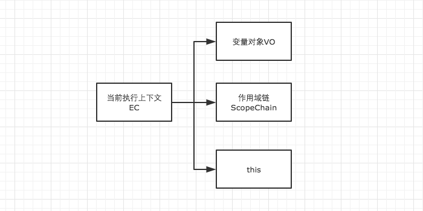

# 执行上下文栈


从 [执行上下文](execution-context.md) 中我们得知，当我们调用一个函数时（激活），一个新的执行上下文就会被创建。而一个执行上下文的生命周期可分为两个阶段。

- 创建阶段：在这个阶段中，执行上下文会分别**创建变量对象**，**建立作用域链**，以及**确定this的指向**。
- 代码执行阶段：创建完成之后，就会开始执行代码，这个时候，会完成**变量赋值**，**函数引用**，以及**执行其他代码**。



## 可执行代码

JavaScript 的可执行代码(executable code)的类型有哪些了？

其实很简单，就三种，全局代码、函数代码、eval代码。

举个例子，当执行到一个函数的时候，就会进行准备工作，这里的“准备工作”，让我们用个更专业一点的说法，就叫做"执行上下文(execution context)"。

## 执行上下文栈

接下来问题来了，我们写的函数多了去了，如何管理创建的那么多执行上下文呢？

所以 JavaScript 引擎创建了执行上下文栈（Execution context stack，ECS）来管理执行上下文

为了模拟执行上下文栈的行为，让我们定义执行上下文栈是一个数组：

```js
ECStack = [];
```

试想当 JavaScript 开始要解释执行代码的时候，最先遇到的就是全局代码，所以初始化的时候首先就会向执行上下文栈压入一个全局执行上下文，我们用 globalContext 表示它，并且只有当整个应用程序结束的时候，ECStack 才会被清空，所以程序结束之前， ECStack 最底部永远有个 globalContext：

```js
ECStack = [
    globalContext
];
```

现在 JavaScript 遇到下面的这段代码了：

```js
function fun3() {
    console.log('fun3')
}

function fun2() {
    fun3();
}

function fun1() {
    fun2();
}

fun1();
```

当执行一个函数的时候，就会创建一个执行上下文，并且压入执行上下文栈，当函数执行完毕的时候，就会将函数的执行上下文从栈中弹出。知道了这样的工作原理，让我们来看看如何处理上面这段代码：

```js
// 伪代码

// fun1()
ECStack.push(<fun1> functionContext);

// fun1中竟然调用了fun2，还要创建fun2的执行上下文
ECStack.push(<fun2> functionContext);

// 擦，fun2还调用了fun3！
ECStack.push(<fun3> functionContext);

// fun3执行完毕
ECStack.pop();

// fun2执行完毕
ECStack.pop();

// fun1执行完毕
ECStack.pop();

// Javascript接着执行下面的代码，但是ECStack底层永远有个globalContext
```


本章节转载自 [JavaScript深入之执行上下文栈](https://github.com/mqyqingfeng/Blog/issues/4)