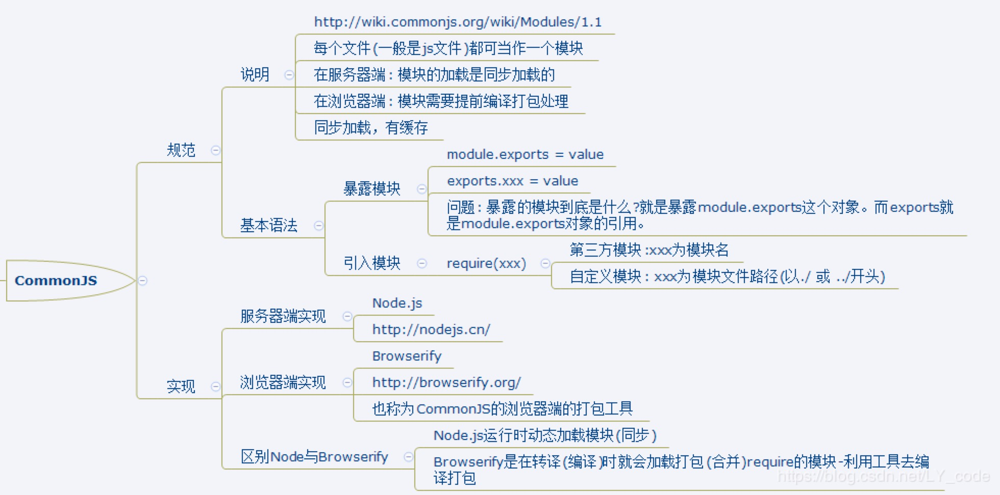

## 模块化

🌽 **模块化**：把复杂的系统分解到多个模块以方便编码

在**模块化编程**中，开发者将程序分解成离散功能块（discrete chunks of functionality），并称之为_模块_。 

* 将一个复杂的程序依据一定的规则（规范）封装成几个块（文件），并进行组合在一起
* 块的内部数据相对而言是私有的，只是向外部暴露一些接口与外部其他模块通信

每个模块具有比完整程序更小的接触面，使得校验、调试、测试轻而易举。 精心编写的_模块_提供了可靠的抽象和封装界限，使得应用程序中每个模块都具有条理清楚的设计和明确的目的。 

### 模块化趋势

#### 痛点


过去代码组织方式，会出现的问题： 

*  命名空间冲突 
*  无法合理地管理项目依赖和版本 
*  无法方便控制依赖的加载顺序 
*  项目体积变大后难以维护 

#### 优势

实现模块化能实现的优势：

* 方便代码维护
* 提高代码复用性
* 降低代码耦合度（解耦）
* 分治思想

### 模块化进化史

#### 全局模式

**module1.js**

```js
// 数据
let data1 = 'module one data'

// 操作数据的函数
function foo() {
  console.log(`foo() ${data1}`)
}
function bar() {
  console.log(`bar() ${data1}`)
}
```

**module2.js**

```js
let data2 = 'module two data';

function foo() {  //与模块1中的函数冲突了
  console.log(`foo() ${data2}`)
}
```

**test.html**

```html
<!-- 同步引入，若函数冲突，则后面覆盖前面 -->
<script type="text/javascript" src="module1.js"></script>
<script type="text/javascript" src="module2.js"></script>
<script type="text/javascript">
  foo()   // foo() module two data
  bar()   // bar() module one data
</script>
```

**说明：**

* 全局模式：将不同的功能封装成不同的全局函数
* 问题：Global 被污染了，很容易引起命名冲突

#### 单例模式

**module1.js**

```js
let moduleOne = {
  data: 'module one data',
  foo() {
    console.log(`foo() ${this.data}`)
  },
  bar() {
    console.log(`bar() ${this.data}`)
  }
}
```

**module2.js**

```js
let moduleTwo = {
  data: 'module two data',
  foo() {
    console.log(`foo() ${this.data}`)
  },
  bar() {
    console.log(`bar() ${this.data}`)
  }
}
```

**test.html**

```html
<script type="text/javascript" src="module1.js"></script>
<script type="text/javascript" src="module2.js"></script>
<script type="text/javascript">
  moduleOne.foo()   //foo() module one data
  moduleOne.bar()   //bar() module one data

  moduleTwo.foo()  //foo() module two data
  moduleTwo.bar()  //bar() module two data

  moduleOne.data = 'update data' //能直接修改模块内部的数据
  moduleOne.foo()  //foo() update data
</script>
```

说明：

- 单例模式模式：简单对象封装
- 作用：减少了全局变量（如两个模块的 `data` 都不是全局变量了，而是对象的某一个属性）
- 问题：不安全，可以直接修改模块内部的数据

#### IIFE模式

**module1.js**

```js
(function (window) {
  //数据
  let data = 'IIFE module data'

  //操作数据的函数
  function foo() { //用于暴露的函数
    console.log(`foo() ${data}`)
  }

  function bar() {//用于暴露的函数
    console.log(`bar() ${data}`)
    otherFun() //内部调用
  }

  function otherFun() { //内部私有的函数
    console.log('privateFunction go otherFun()')
  }

  //暴露foo函数和bar函数
  window.moduleOne = {foo, bar}
})(window)
```

**test.html**

```html
<script type="text/javascript" src="module1.js"></script>
<script type="text/javascript">
  moduleOne.foo()  //foo() IIFE module data
  moduleOne.bar()  //bar() IIFE module data    privateFunction go otherFun()
  //moduleOne.otherFun()  //报错，moduleOne.otherFun is not a function
  console.log(moduleOne.data) //undefined 因为我暴露的moduleOne对象中无data
  moduleOne.data = 'xxxx' //不是修改的模块内部的data，而是在moduleOne新增data属性
  moduleOne.foo() //验证内部的data没有改变  还是会输出 foo() IIFE module data
</script>
```

说明：

- IIFE模式：匿名函数自调用（闭包）
- IIFE：Immediately-Invoked Function Expression（立即调用函数表达式）
- 作用：数据是私有的，外部只能通过暴露的方法操作
- 问题：如果当前这个模块依赖另一个模块怎么办？见下面IIFE增强版的（模块依赖于 jQuery）

#### IIFE模式增强

引入 jQuery 到项目中

**module1.js**

```js
(function (window,$) {
  //数据
  let data = 'IIFE Strong module data'

  //操作数据的函数
  function foo() { //用于暴露的函数
    console.log(`foo() ${data}`)
    $('body').css('background', 'red')
  }

  function bar() {//用于暴露的函数
    console.log(`bar() ${data}`)
    otherFun() //内部调用
  }

  function otherFun() { //内部私有的函数
    console.log('privateFunction go otherFun()')
  }

  //暴露foo函数和bar函数
  window.moduleOne = {foo, bar}
})(window,jQuery)
```

**test.html**

```html
<!--引入的js必须有一定顺序-->
<script type="text/javascript" src="jquery-1.10.1.js"></script>
<script type="text/javascript" src="module1.js"></script>
<script type="text/javascript">
  moduleOne.foo()  //foo() IIFE Strong module data  而且页面背景会变色
</script>
```

说明：

- IIFE 模式增强：引入依赖

- 这就是现代模块实现的基石。其实很像了，有引入和暴露两个方面。

- 存在的问题：一个页面需要引入多个 JS 文件的问题

  ```html
  <script type="text/javascript" src="module1.js"></script>
  <script type="text/javascript" src="module2.js"></script>
  <script type="text/javascript" src="module3.js"></script>
  <script type="text/javascript" src="module4.js"></script>
  ```

  请求过多：一个 `<script>` 标签就是一次请求
  依赖模糊：看不出来谁依赖着谁？哪些模块是有依赖关系的，很难看出来。
  难以维护：内部依赖关系混乱也就难以维护啦


### 模块化方案

#### CommonJS 

CommonJS 是服务器端模块的规范，Node.js  就是采用了这个规范。但目前也可用于浏览器端，需要使用 Browserify 进行提前编译打包。

CommonJS 模块化的引入方式使用 `require` ； 暴露的方式使用 `module.exports` 或 `exports`。



**特点**

* 同步加载依赖的模块 

* 可复用于Node环境 

* 成熟的第三方模块社区 

**彻底说明白 `module.exports` 和 `exports` 的区别：**

在 Node.js 中，`module` 是一个全局变量，类似于在浏览器端的 `window` 也是一个全局变量一样的道理。

`module.exports` **初始**的时候置为空对象，`exports`也指向这个空对象。

内部的代码实现是：

```js
var module = {
    id: 'xxxx',
    exports: {},
}

var exports = module.exports;  
// exports 是对 module.exports 的引用
// 也就是 exports 现在指向的内存地址和 module.exports 指向的内存地址是一样的
```

上面的代码可以看出我们平常使用的 `exports` 是对 `module.exports` 的一个引用，两者都是指向同一个对象。

用一句话来说明就是，模块的 `require`（引入）能看到的只有 `module.exports` 这个对象，它是看不到 `exports` 对象的，而我们在编写模块时用到的 `exports` 对象实际上只是对 `module.exports` 的引用。（`exports = module.exports`）。

我们可以使用 `exports.a = ‘xxx’` 或 `exports.b = function(){}` 添加方法或属性，本质上它也添加在 `module.exports` 所指向的对象身上。但是你不能直接 `exports = { a: 'xxx'}` 这样子的意义就是将 `exports` 重新指向新的对象！它和 `module.exports` 就不是指向同一个对象，也就这两者已经失去了关系，而 Node.js 中`require`（引入）能看到的是 `module.exports` 指向的对象。 

因此，我们一般都会直接使用：

```js
module.exports
```

 再举例说明两者区别：

```js
function foo() {
  console.log('foo');
}

function bar() {
  console.log('bar');
}
```

想要将这两个函数暴露出去，可以直接使用`exports`

```js
exports.foo = foo;
exports.bar = bar;
```

也可以对`module.exports`赋值

```js
module.exports = {
  foo: foo,
  bar: bar
}
```

但是不能直接对`exports`赋值

```js
// 错误
exports = {
  foo: foo,
  bar: bar
}
```

因为这样做仅仅改变了`exports`的引用，而不改变`module.exports`。 好，剧终。这个问题讲明白了吧。

**总结**
**特点**：同步加载，有缓存
**用法**：抓住引入和暴露

- 暴露模块
  - `exports`
  - `module.exports`
- 引入模块
   - `require(路径参数)`
   - 路径： 自定义模块：路径必须以 `./` 或者 `../` 开头
   - 第三方模块/内置模块/核心模块：路径直接使用模块名称

主要是在服务器端使用的，但是也能在浏览器端运行，需要借助 `browserify` 进行编译。

#### AMD 

> CommonJS 规范加载模块是同步的，也就是说，只有加载完成，才能执行后面的操作。由于 NodeJS 主要用于服务器编程，模块文件一般都已经存在于本地硬盘，所以加载起来比较快，所以同步加载没有问题。但是如果是浏览器端，同步加载很容易阻塞，这时候 AMD 规范就出来了。AMD 规范则是非同步加载模块，允许指定回调函数。故浏览器端一般会使用 AMD 规范。

AMD 是 RequireJS 在推广过程中对模块定义的规范化产出 。


**特点：**

异步加载依赖的模块 

可在不转换代码的情况下直接在浏览器运行 

并行加载多个模块 

可运行在浏览器和Node环境 

**应用实践**

1. 下载`require.js`, 并引入

   官网: http://www.requirejs.cn/
    Github : https://github.com/requirejs/requirejs
    将 `require.js` 导入项目：`js/libs/require.js`

2. 创建项目结构

   ```
   |-libs
     |-require.js
   |-modules
     |-alerter.js
     |-dataService.js
   |-main.js
   |-index.html
   ```

3. 定义 `require.js` 的模块代码
    `dataService.js` (定义一个无依赖的模块)

   ```js
   define(function () {
     let msg = 'hello world lyuya';
     function dataServer() {
       return msg.toUpperCase();
     }
     //暴露这个模块
     return dataServer;
   });
   ```

   `alerter.js` (定义一个有依赖的模块)
    定义方法：`define(['模块1', '模块2', '模块3'], function (m1, m2，m3) {})`  注意前后一一对应

   ```js
   //一定要注意一一对应，前面有，后面一定要有，别忘记后面的传参
   define(['dataServer'],function (dataServer) {
     let msg = dataServer();
     function alerter() {
       alert(msg);
     }
     return alerter;
   });
   ```

4. 应用主(入口)：`main.js` (主模块)

   ```js
   //配置模块的路径
   requirejs.config({
     baseUrl:'./',  //配置所有引入模块的公共路径（基本路径）
     //模块标识名与模块路径映射
     paths : {
       // 模块名称（一定要与引入的模块名称一一对应）: 模块的路径
       dataServer: 'modular/dataServer',  
       //一定不能写文件的后缀名，它会自动补全
       alerter: 'modular/alerter',
       //库/框架自己实现模块化的功能，定义了暴露模块的名称
       jquery: 'libs/jquery-1.10.1'
     }
   })
   
   //主模块,下面requirejs可以用require代替,require是异步可缓存的
   requirejs(['alerter','jquery'],function (alerter,$) {
     alerter();
     $('body').css('background','pink')
   });
   ```

5. 在页面`index.html`中使用模块

   ```html
   <!--src引入requirejs模块去用这个模块解析主模块-->
   
   <script data-main="./main" src="./libs/require.js"></script>
   ```

**总结 `require.js`**
 特点：异步加载，有缓存
 用法：（抓住引入和暴露）

- 暴露模块
  - 在模块内部使用`return`
- 定义模块
  - `define(['模块名'], function (模块暴露内容) {})`
  - `require(['模块名'], function (模块暴露内容) {})`
  - 在模块内部可以使用`require`定义异步模块
- 主模块：
   - `requirejs.config({})` 配置使用的模块路径``
   - ``requirejs(['模块名'], function (模块暴露内容) {})`
- HTML 文件引入 `<script>` 标签
   - `<script data-main='app.js' src='require.js'></script>`

AMD（通用模块定义）主要是在浏览器使用的。

#### CMD

CMD 是根据 CommonJS 和 AMD 基础上提出的。
 CMD（通用模块定义）和 AMD（异步模块定）是比较相似的。
 RequireJS 遵循的是 AMD（异步模块定义）规范，SeaJS 遵循的是 CMD （通用模块定义）规范。
`Sea.js` 是国人阿里建立的，代表着海纳百川之意。


**应用实践**

1. 下载 `Sea.js`，并引入

   官网：http://seajs.org/
   Github：https://github.com/seajs/seajs
   将 `Sea.js` 导入项目：`libs/sea.js`

2. 创建项目结构

   ```
   |-libs 
     |-sea.js 
   |-modules 
     |-module1.js 
     |-module2.js 
     |-module3.js 
     |-module4.js 
   |-main.js 
   |-index.html
   ```

3. 定义`sea.js`的模块代码
    `module1.js`

   ```js
   define(function (require, exports, module) {
       /*
         require: 引入依赖模块
         exports: 暴露模块
         module: 暴露模块
        */
       const msg = 'moduleone';
       function getMsg() {
         console.log('module1 getMsg() ' + msg);
         return msg;
       }
       //暴露模块
       module.exports = getMsg;
     })
   ```

   `module2.js`

   ```js
    define(function (require, exports, module) {
       exports.msg1 = 'lyuya';
       exports.msg2 = 'hello';
     })
   ```

   `module3.js`

   ```js
     define(function (require, exports, module) {
       //同步引入模块
       const getMsg = require('./module1');
   
       let msg = getMsg();
   
       msg = msg.toUpperCase();
   
       module.exports = {
         msg
       }
   
     })
   ```

   `module4.js`

   ```js
     //异步引入模块
       require.async('./module2', function (m2) {
         console.log(m2.msg1, m2.msg2);
       })
       console.log('module4执行了~~~');
     })
   ```

   `main.js` ：主(入口)模块

   ```js
   define(function (require) {
       const m3 = require('./module3');
       require('./module4');
   
       console.log(m3.msg);
     })
   ```

   `index.html:`

   ```html
   <script type="text/javascript" src="libs/sea.js"></script> 
   <script type="text/javascript"> seajs.use('./modules/main') </script>
   ```

   结果输出：

   ```
   module1 getMsg() moduleone      =====module1.js:12
   
   module4执行了~~~               =====module4.js:9 
   
   MODULEONE                       =====main.js:9
   
   lyuya hello                 =====module4.js:7 
   ```

**总结 `Sea.js`**

特点：异步加载，有缓存
用法：

- 定义模块
  - `define(function (require, exports, module) {})`
- 引入模块
  - 同步加载 `require()`
  - 异步加载 `require.async(['模块名'], function(模块暴露内容) {})`
- 暴露模块
  - `exports`
  - `module.exports`
- HTML 文件引入 `<script>`标签
  - `<script src='sea.js'></script>`
  - `<script>seajs.use('app.js')</script>`

`sea.js` 和 `require.js` 一样主要在浏览器中使用。其实这两个一般都很少使用。用的比较多的是 `commonjs` 和马上要介绍的 ES6 模块化。

#### ES6 Module 


**总结 ES6 Module**
 特点：动态引入（按需加载），没有缓存
 用法：抓住引入和暴露

- 引入模块使用 `import`

  - 对于统一暴露/分别暴露
     `import {模块暴露的内容} from '模块路径'` 或 `import * as m1 from './module1'`
     这两者暴露的本质是对象，接收的时候只能以对象的解构赋值的方式来接收值
  - 对于默认暴露
     直接使用 `import 模块暴露的内容 from '模块路径'`
     默认暴露，暴露任意数据类型，暴露什么数据类型，接收什么数据类型

- 暴露模块使用 `export`

  - 分别暴露 （基本不用）
  - 统一暴露 （暴露多个内容）
  - 默认暴露 （暴露单个内容）

主要是用在浏览器，服务器端也使用。但是现在浏览器和服务器均不支持ES6的模块化语法，所以要借助工具来编译运行

- `Babel`  将ES6 - ES5  （ES6的模块化语法 编译成`commonjs`）
- Browserify 将 CommonJS语法编译成能让浏览器识别的语法

### 模块化与组合化

既然说到模块化，其实我更想说说模块化与组件化。这两个概念在前端领域已经十分普遍。

先有模块化后有组件化。组件化是建立在模块化思想上的一次演进，一个变种。所以，我们会在软件工程体系中看过一句话：模块化是组件化的基石。

组件化和模块化的思想都是分而治之的思想。但还是有细小的区分，他们的侧重点有所不同。

组件化更加倾向于 UI 层面上，是一个可以独立展示内容的「积木」，比如一个页面的头部组件，包含结构 HTML、样式 CSS、逻辑 JS、以及静态资源图片组合一个集合体。一个页面是由众多组件组成的，就像由众多「积木」搭成的「城堡」一样； 模块化更加倾向于功能或者数据的封装，一般由几个组件或1个组件构成的带有一定功能的集合体；

引用一下[@张云龙](https://link.juejin.im/?target=https%3A%2F%2Fgithub.com%2Ffouber%2Fblog%2Fissues%2F10)「👈大神」对组件化的理解：


就如上图的这个 `title` 组件，包含了结构HTML、样式CSS、逻辑JS、以及静态资源图片，往往组件的组成就是以上四个方面。这个 `header` 文件夹我们可以拿到其他项目中使用，它具有可以独立展示内容的特点。

结合前面提到的模块化开发，整个前端项目可以划分为这么几种开发概念：

| 名称     | 说明                                            | 举例                                                         |
| -------- | ----------------------------------------------- | ------------------------------------------------------------ |
| JS 模块  | 独立算法和数据单元                              | 浏览器环境检测（detect）、网络请求（ajax）、应用配置（config）、DOM 操作（dom）、工具函数（utils）以及组件里的 JS 单元 |
| CSS 模块 | 独立的功能性样式单元                            | 栅格系统（grid）、字体图标（icon-fonts）、动画样式（animate）以及组件里的 CSS 单元 |
| 页面     | 前端这种 GUI 软件的的界面状态，是 UI 组件的容器 | 首页（index）、列表页（list）、用户管理（user）              |
| 应用     | 整个项目或整个站点被称之为应用，由多个页面组成  |                                                              |

那么它们之间的关系如下图所示，一个应用由多个下图的页面组成。一个页面由多个组件组合。组件中可依赖 JS 模块。


所以，前端开发现在不仅仅只是别人说的「画画页面实现点效果」的职位，它是实现软件的图形用户界面（Graphical User Interface，简称GUI），是一名软件工程师。现在前端开发都是基于模块化和组件化的开发，可以说算是工程化的项目了。从单页面（SPA）的应用就可以看出 JavaScript 大大改善了 Web 应用的用户体验。从谷歌提出PWA（Progressive Web Apps）就可以看出前端在领域的成长。

不仅仅如此，多终端也已经成为时下以及未来的一个必然趋势，移动端、PC端、触摸屏、智能设备、物联网等等，相信前端在跨端的领域下肯定会有更好的解决方案。

但是，如果从整个软件工程来看，我们就会意识到一个惨痛的事实：前端工程师在整个系统工程中的地位太低了。前端是处于系统软件的上游（用户入口），因此没有其他系统会来调取前端系统的服务。而后端它在软件开发中处于下游，后端一方面要为前端提供接口服务，一方面要向中后台以及数据层索取服务，对接层次会更多，地位也就更高了。由此导致，感觉每次需求评估前端往往是最后一道坎，因为上游依托下游，就只能是下游先行了，整体上就会感觉前端对业务的参与度太低了。

---

**参考资料：**

* [从前端模块化编程切入想聊聊前端的未来](https://juejin.im/post/5c82323ce51d453a5f22b281)
* [前端模块化开发那点历史](https://link.juejin.im/?target=https%3A%2F%2Fgithub.com%2Fseajs%2Fseajs%2Fissues%2F588)
* [Javascript模块化编程@阮一峰](https://link.juejin.im/?target=http%3A%2F%2Fwww.ruanyifeng.com%2Fblog%2F2012%2F10%2Fjavascript_module.html)
* [知乎专栏 | AMD和CMD的区别](https://link.juejin.im/?target=https%3A%2F%2Fwww.zhihu.com%2Fquestion%2F20351507%2Fanswer%2F14859415)