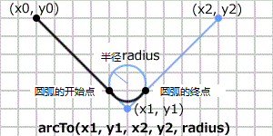

## 绘制路径

绘制路径的相关方法如下：

- 路径
  - [beginPath()](#beginpath)
  - [moveTo()](#moveto)
  - [closePath()](closepath)
- 直线
  - [lineTo()](#lineto)
- 贝塞尔曲线
  - [quadraticCurveTo()](#quadraticcurveto)
  - [bezierCurveTo()](#beziercurveto)
- 圆与圆弧
  - [arcTo()](#arcto)
  - [arc()](#arc)
- 四角形
  - [rect()](#rect)
- 路径的样式
  - [fill()](#fill)
  - [stroke()](#stroke)
- 剪切路径
  - [clip()](#clip)
- 确认路径
  - [isPointInPath()](#ispointInpath)
  - [isPointInStroke()](#ispointInstroke)
- 其他
  - [drawFocusIfNeeded()](#drawfocusIfneeded)
  - [scrollPathIntoView()](#scrollpathIntoview)

### beginPath()

`CanvasRenderingContext2D.beginPath()` 方法用于宣布开始绘制路径，或重置当前的路径。

📌 实际上使用路径开始绘画图形时，还需要与 `moveTo(x, y)`、`lineTo(x, y)`、`closePath` 等方法配合使用。

📌 在完成的路径上绘画时，需要与 `stroke()` 、`fill()` 方法配合使用。

#### 语法

```js
context.beginPath()
```

##### 绘制直线

绘制直线步骤如下：

1. 使用 `beginPath()` 宣布开始绘制路径
2. 使用 `moveTo(x, y)` 指定开始位置的坐标
3. 使用 `lineTo(x, y)` 指定线的下一个坐标点
4. 使用 `stroke()` 表示路径的轮廓

##### 绘制三角形

绘制三角形步骤如下：

1. 使用 `beginPath()` 宣布开始绘制路径
2. 使用 `moveTo(x, y)` 指定开始位置的坐标
3. 使用 `lineTo(x, y)` 指定线段的下一个坐标点（第一条线）
4. 使用 `lineTo(x, y)` 指定线段的下一个坐标点（第二条线）
5. 使用 `closePath(x, y)` 闭合路径（绘制第三条线闭合图形）
6. 使用 `stroke()` 表示路径的轮廓

#### 示例

```html
<canvas id='canvas'></canvas>
```

```js
const canvas = document.getElementById('canvas');
const ctx = canvas.getContext('2d');

// First path
ctx.beginPath();
ctx.strokeStyle = 'blue';
ctx.moveTo(20, 20);
ctx.lineTo(200, 20);
ctx.stroke();

// Second path
ctx.beginPath();
ctx.strokeStyle = 'green';
ctx.moveTo(20, 20);
ctx.lineTo(120, 120);
ctx.stroke();
```

### moveTo()

`CanvasRenderingContext2D.moveTo()` 方法可将一个新的子路径的起始点移动到指定坐标。该坐标以 Canvas 元素的左上端为基准。

#### 语法

```js
context.moveTo(x, y)
```

| 参数 | 说明                 | 类型   |
| ---- | -------------------- | ------ |
| x    | 路径目标位置的横坐标 | number |
| y    | 路径目标位置的纵坐标 | number |

#### 示例

```html
<canvas id='canvas'></canvas>
```

```js
const canvas = document.getElementById('canvas');
const ctx = canvas.getContext('2d');

ctx.beginPath();
ctx.moveTo(50,50);
ctx.lineTo(200, 50);
ctx.stroke();
```

### closePath()

`CanvasRenderingContext2D.closePath()` 方法用于连接起始坐标与最终坐标点，闭合路径。

使用 `closePath()` 连接起始坐标与最终坐标点，闭合路径，完成完整的图形。如果没有子路径，即使使用 `closePath()` 也不会出现任何结果。

#### 语法

```js
context.closePath()
```

#### 示例

```html
<canvas id='canvas'></canvas>
```

```js
const canvas = document.getElementById('canvas');
const ctx = canvas.getContext("2d");

ctx.beginPath();
ctx.moveTo(20,20);
ctx.lineTo(200,20);
ctx.lineTo(120,120);
ctx.closePath(); 		// draws last line of the triangle
ctx.stroke();
```

### lineTo()

`CanvasRenderingContext2D.lineTo()` 方法添加一个新点，然后创建从该点到画布中最后指定点的线条（该方法并不会创建线条）。

📌 请使用 `stroke()` 方法在画布上绘制确切的路径。

#### 语法

```js
context.lineTo(x, y)
```

| 参数 | 说明                    | 类型   |
| ---- | ----------------------- | ------ |
| x    | 路径的目标位置的 x 坐标 | number |
| y    | 路径的目标位置的 y 坐标 | number |

#### 示例

```html
<canvas id='canvas'></canvas>
```

```js
const canvas = document.getElementById("canvas");
const ctx = canvas.getContext("2d");

ctx.beginPath();
ctx.moveTo(0,0);
ctx.lineTo(100, 100);
ctx.stroke(); 
```

### quadraticCurveTo()

`CanvasRenderingContext2D.quadraticCurveTo()` 方法通过使用二次贝塞尔曲线的指定控制点，向当前路径添加一个点。

📌 提示：二次贝塞尔曲线需要两个点。第一个点是用于二次贝塞尔计算中的控制点，第二个点是曲线的结束点。曲线的开始点是当前路径中最后一个点。如果路径不存在，那么请使用 `beginPath()` 或 `moveTo()` 方法来定义开始点。


- `quadraticCurveTo(cpx, cpy, x, y)` 方法由1个控制点与1个追加坐标点绘制二维贝塞尔曲线。
- `bezierCurveTo(cp1x, cp1y, cp2x, cp2y, x, y)` 方法则是由2个控制点和1个追加坐标点绘制三维贝塞尔曲线。

#### 语法

```js
context.quadraticCurveTo(cpx, cpy, x, y)
```

| 参数 | 说明                  | 类型   |
| ---- | --------------------- | ------ |
| cpx  | 贝塞尔控制点的 x 坐标 | number |
| cpy  | 贝塞尔控制点的 y 坐标 | number |
| x    | 结束点的 x 坐标       | number |
| y    | 结束点的 y 坐标       | number |

##### 绘制步骤

1. 使用 `beginPath()` 方法宣布开始绘制路径
2. 使用 `moveTo(x, y)` 指定开始位置的坐标
3. 使用 `quadraticCurveTo(x, y)` 绘制二维贝塞尔曲线
4. 使用 `stroke()` 表示路径轮廓

#### 示例

```html
<canvas id='canvas'></canvas>
```

```js
const canvas = document.getElementById('canvas');
const ctx = canvas.getContext('2d');

ctx.beginPath();
ctx.moveTo(50, 20);
ctx.quadraticCurveTo(230, 30, 50, 100);
ctx.stroke();

ctx.fillStyle = 'blue';
// start point
ctx.fillRect(50, 20, 10, 10);
// end point
ctx.fillRect(50, 100, 10, 10);

ctx.fillStyle = 'red';
// control point
ctx.fillRect(230, 30, 10, 10);
```

<a target='_blank' href='https://codepen.io/mrsingsing/pen/JavQYz?editors=1010'>🔎在 CodePen 中打开</a>

### bezierCurveTo()

`CanvasRenderingContext2D.bezierCurveTo()` 方法通过使用表示三次贝塞尔曲线的指定控制点，向当前路径添加一个点。

📌 提示：三次贝塞尔曲线需要三个点。前两个点是用于三次贝塞尔计算中的控制点，第三个点是曲线的结束点。曲线的开始点是当前路径中最后一个点。如果路径不存在，那么请使用 `beginPath()` 和 `moveTo()` 方法来定义开始点。


- `quadraticCurveTo(cpx, cpy, x, y)` 方法由1个控制点与1个追加坐标点绘制二维贝塞尔曲线。
- `bezierCurveTo(cp1x, cp1y, cp2x, cp2y, x, y)` 方法则是由2个控制点和1个追加坐标点绘制三维贝塞尔曲线。

#### 语法

```js
context.bezierCurveTo()
```

| 参数 | 说明                    | 类型   |
| ---- | ----------------------- | ------ |
| cp1x | 第一个控制点的 x 轴坐标 | number |
| cp1y | 第一个控制点的 y 轴坐标 | number |
| cp2x | 第二个控制点的 x 轴坐标 | number |
| cp2y | 第二个控制点的 y 轴坐标 | number |
| x    | 结束点的 x 轴坐标       | number |
| y    | 结束点的 y 轴坐标       | number |

##### 绘制步骤

1. 使用 `beginPath()` 方法宣布开始绘制路径
2. 使用 `moveTo(x, y)` 指定开始位置的坐标
3. 使用 bezierCurveTo(x, y)` 绘制二维贝塞尔曲线
4. 使用 `stroke()` 表示路径轮廓

#### 示例

```html
<canvas id='canvas'></canvas>
```

```js
const canvas = document.getElementById('canvas');
const ctx = canvas.getContext('2d');

ctx.beginPath();
ctx.moveTo(50, 20);
ctx.bezierCurveTo(230, 30, 150, 60, 50, 100);
ctx.stroke();

ctx.fillStlye = 'blue';
// start point
ctx.fillRect(50, 20, 10, 10);
// end point
ctx.fillRect(50, 100, 10, 10);

ctx.fillStyle = 'red';
// control point one
ctx.fillRect(230, 30, 10, 10);
// control point two
ctx.fillRect(150, 70, 10, 10);
```

<a target='_blank' href='https://codepen.io/mrsingsing/pen/KxRjzy?editors=1010'>🔎在 CodePen 中打开</a>

### arcTo()

`CanvasRenderingContext2D.arcTo()` 方法绘制坐标与直线之间的连接圆弧

#### 语法

```js
context.arcTo(x1, y1, x2, y2, radius)
```

| 参数   | 说明                                                    | 类型 |
| ------ | ------------------------------------------------------- | ---- |
| x1     | 圆弧的半径为0时，直线与之前坐标(x0,y0)的连接点的 x 坐标 |      |
| y1     | 圆弧的半径为0时，直线与之前坐标(x0,y0)的连接点的 y 坐标 |      |
| x2     | 圆弧的半径为0时，直线与坐标(x1,y1)的连接点的 x 坐标     |      |
| y2     | 圆弧的半径为0时，直线与坐标(x1,y1)的连接点的 y 坐标     |      |
| radius | 圆弧的半径                                              |      |

#### 原理

圆弧半径 `radius` 为0时，参数 `(x1, y1)` 为前一坐标 `(x0, y0)` 与直线的连接点坐标。参数 `(x2, y2)` 为当圆弧半径 `radius` 的值为0时，坐标 `(x1, y1)` 与直线的连接点的坐标。这里的坐标都以 Canvas 元素的左上端为基准。

注意：参数 `(x1, y1)` 与 `(x2, y2)` 不是圆弧的开始点和终点。圆弧的开始点与终点是自动计算的。

参数 `radius` 为圆弧的半径，当圆弧的半径设置为负时，会显示出错（INDEX_SIZE_ERR）。

1. 假定之前的坐标点 `(x0, y0)` 与点 `(x1, y1)` 的连接直线
2. 连接之前的坐标点 `(x0, y0)` 到圆弧开始点之间的直线
3. 自动计算出圆弧的开始点，追加子路径
4. 连接点 `(x0, y0)` ➡️点 `(x1, y1)` ➡️点 `(x2, y2)` ，使用最短的半径 radius 圆弧连接
5. 自动计算出圆弧的终点，追加子路径




#### 示例

```html
<canvas id='canvas'></canvas>
```

```js
const canvas = document.getElementById('canvas');
const ctx = canvas.getContext('2d');

ctx.moveTo(50, 50);
ctx.lineTo(150, 50);
ctx.arcTo(200, 50, 200, 100, 50);

ctx.strokeStyle = "blue";
ctx.stroke();
```

<a target='_blank' href='https://codepen.io/mrsingsing/pen/NLMoLr'>🔎在 CodePen 中打开</a>

### arc()

`CanvasRenderingContext2D.arc()` 方法

提示：如果通过 `arc()` 来创建圆，请把起始角设置为0，结束角设置为 `2*Math.PI`。

提示：请使用 `stroke()` 和 `fill()` 方法在画布上绘制实际的弧。

#### 语法

```js
context.arc(x, y, radius, startAngle, endAngle [, anticlockwise])
```

| 参数          | 说明                                                      | 类型    |
| ------------- | --------------------------------------------------------- | ------- |
| x             | 圆弧中心的 x 坐标                                         | number  |
| y             | 圆弧中心的 y 坐标                                         | number  |
| radius        | 圆弧的半径                                                | number  |
| startAngle    | 圆弧开始的角度                                            | number  |
| endAngle      | 圆弧结束的角度                                            | number  |
| anticlockwise | 可选。圆弧的作成方向逆时针（true）顺时针（false，默认值） | boolean |

#### 原理

圆弧的开始角度与终点角度以 x 轴的正方向为回转基准。圆弧的生成方向由参数 `anticlockwise` 指定，开始角度与结束角度的计测方向为顺时针方向。


圆弧的生成方向以逆时针方向时为 `true` ，顺时针方向时为 `false`。省略时，也就是初始值为 `false`。如果圆弧的半径为负值时，会显示出错（INDEX_SIZE_ERR）。

角度的单位为弧度，弧度的单位值：`角度÷ 180 × π`

`arc()` 方法的基本实现过程

1. 设定要制作的圆的中心坐标点 `(x, y)` 与圆弧半径 `radius`
2. 从 x 轴的正区域开始计算开始角度与结束角度的回转弧度
3. 计算出圆弧的开始点与结束点的坐标
4. 如果已经存在子路径，之前的点与圆弧的点用直线连接
5. 从圆弧的开始点到结束点，按照指定方向制作圆弧
6. 圆弧的开始点与结束点之间追加子路径

圆弧的开始角度与结束角度的差为 2π（360度）以上的情况吓，圆弧为圆周全体。

#### 示例

```html
<canvas id='canvas'></canvas>
```

```js
const canvas = document.getElementById('canvas');
const ctx = canvas.getContext('2d');

ctx.beginPath();
ctx.strokeStyle = 'blue';
ctx.arc(100, 100, 50, 0, Math.PI/2, false);

ctx.stroke();
```

<a target='_blank' href='https://codepen.io/mrsingsing/pen/ZMoPyM?editors=1010'>🔎在 CodePen 中打开</a>

### rect()

`CanvasRenderingContext2D.rect` 通过设置矩形起点`(x, y)`，尺寸 `width` 和 `height` ，以创建矩形路径的方法。此方法仅绘制矩形，调用 `stoke()` 或 `fill()` 后才会真正作用于画布。

### 语法

```js
context.rect(x, y, width, height);
```

| 参数   | 说明             | 类型   |
| ------ | ---------------- | ------ |
| x      | 矩形起点的横坐标 | number |
| y      | 矩形起点的纵坐标 | number |
| width  | 矩形的宽度       | number |
| height | 矩形的高度       | number |

#### 示例

```js
const canvas = document.getElementById('canvas');
const ctx = canvas.getContext('2d');
ctx.rect(10, 10, 100, 100);
ctx.fill();
```

### fill()

`CanvasRenderingContext2D.fill()` 方法以根据当前的填充样式，填充当前或已存在的路径。采取非零环绕或者奇偶环绕规则。

#### 语法

```js
context.fill()
```

| 参数     | 说明                                                         | 类型          |
| -------- | ------------------------------------------------------------ | ------------- |
| fillRule | 一种决定点在路径内还是路径外的算法：`nonzero`（非零环绕规则，默认规则）`evenodd`（奇偶环绕规则） | string        |
| path     | 需要填充的 Path2D 路径                                       | Path2D object |

#### 示例

```html
<canvas id="canvas"></canvas>
```

```js
const canvas = document.getElementById("canvas");
const ctx = canvas.getContext("2d");
ctx.rect(10, 10, 100, 100);

// 填充路径
ctx.fill();
```

### stroke()

`CanvasRenderingContext2D.stroke()` 使用非零环绕规则，根据当前的画线样式，绘制当前或已经存在的路径的方法。

#### 语法

```js
context.stroke()
```

| 属性 | 说明              | 类型          |
| ---- | ----------------- | ------------- |
| path | 绘制的路径 Path2D | Path2D object |

显示路径时，会受到来自填充样式、线的样式的影响，当使用 `stroke()` 方法、`fill()` 方法显示时，路径将不受影响。路径上可以适用阴影、透明度、切割、合成等。

还有，路径上使用了变形时，绘制路径时将受其影响。`stroke()` 方法与 `fill()` 方法能够显示适用了变形的路径。

#### 示例

```html
<canvas id="canvas"></canvas>
```

```js
const canvas = document.getElementById("canvas");
const ctx = canvas.getContext("2d");

ctx.rect(10, 10, 100, 100);
ctx.stroke();
```

<a target='_blank' href='https://codepen.io/mrsingsing/pen/oPyvrO'>🔎在 CodePen 中打开</a>

### clip()

`CanvasRenderingContext2D.clip()` 方法用以将当前创建的路径设置为当前剪切路径。

#### 语法

```js
context.clip();
context.clip(fillRule);
context.clip(path, fillRule);
```

| 参数     | 说明                                                         | 类型          |
| -------- | ------------------------------------------------------------ | ------------- |
| fillRule | 一种决定点在路径内还是路径外的算法：`nonzero`（非零环绕规则，默认规则）`evenodd`（奇偶环绕规则） | string        |
| path     | 需要剪切的 Path2D 路径                                       | Path2D object |

##### 绘制步骤

1. 制作需要切割的图形的路径
2. 使用 `clip()` 方法切割出需要的图形
3. 绘制被切割出的图形
4. 绘制时，只绘制指定领域内的图形

#### 示例

```html
<canvas id="canvas"></canvas>
```

```js
const canvas = document.getElementById("canvas");
const ctx = canvas.getContext("2d");

// Create clipping region
ctx.arc(100, 100, 75, 0, Math.PI*2, false);
ctx.clip();

ctx.fillRect(0, 0, 100,100);
```

### isPointInPath()

`CanvasRenderingContext2D.isPointInPath()` 用以判断在当前路径中是否包含检测点的方法**。**

#### 语法

```js
context.isPointInPath(x, y);
context.isPointInPath(x, y, fillRule);

context.isPointInPath(path, x, y);
context.isPointInPath(path, x, y, fillRule);
```

| 参数     | 说明                                                         | 类型          |
| -------- | ------------------------------------------------------------ | ------------- |
| x        | 监测点的横坐标                                               | number        |
| y        | 监测点的纵坐标                                               | number        |
| fillRule | 一种决定点在路径内还是路径外的算法：`nonzero`（非零环绕规则，默认规则）`evenodd`（奇偶环绕规则） | fillRule      |
| path     | Path2d 应用的对象                                            | Path2D object |

返回值：布尔值，当检测点包含在当前或指定的路径内，返回 `true`；否则返回 `false`。

#### 示例

```html
<canvas id="canvas"></canvas>
```

```js
const canvas = document.getElementById("canvas");
const ctx = canvas.getContext("2d");

ctx.rect(10, 10, 100, 100);
ctx.stroke();
console.log(ctx.isPointInPath(10, 10)); // true
```

### isPointInStroke()

`CanvasRenderingContext.isPointInStroke()` 用于检测某点是否在路径的描边线上的方法。

#### 语法

```js
context.isPointInStroke(x, y);
context.isPointInStroke(path, x, y);
```

| 参数 | 说明           | 类型          |
| ---- | -------------- | ------------- |
| x    | 监测点的横坐标 | number        |
| y    | 监测点的纵坐标 | number        |
| path | Path2D 的路径  | Path2D object |

#### 示例

```html
<canvs id="canvas"></canvas>
```

```js
const canvas = document.getElementById("canvas");
const ctx = canvas.getContext("2d");

ctx.rect(10, 10, 100, 100);
ctx.stroke();
console.log(ctx.isPointInStroke(10, 10)); // true
```

### drawFocusIfNeeded()

`CanvasRenderingContext2D.drawFocusIfNedded()` 用以给当前路径或特定路径绘制焦点的方法，如果给定的元素获取了焦点。

#### 语法

```js
context.drawFocusIfNeeded(element);
context.drawFocusIfNeeded(path, element);
```

| 属性    | 说明                   | 类型          |
| ------- | ---------------------- | ------------- |
| element | 是否需要设置焦点的元素 | HTMLElement   |
| path    | Path2D 路径            | Path2D object |

#### 示例

```html
<canvas id="canvas">
	<input id="button" type="range" min="1" max="12" />
</canvas>
```

```js
const canvas = document.getElementById("canvas");
const ctx = canvas.getContext("2d");
const button = document.getElementById("button");

button.focus();

ctx.beginPath();
ctx.rect(10, 10, 30, 30);
ctx.drawFocusIfNeeded(button);
```

### scrollPathIntoView()

> ⚗️这是一个实验中的功能

`CanvasRenderingContext2D.scrollPathIntoView()` 方法用以将当前或给定的路径滚动到窗口。

#### 语法

```js
context.scrollPathIntoView()
context.scrollPathIntoView(path)
```

| 参数 | 说明        | 类型          |
| ---- | ----------- | ------------- |
| path | Path2D 路径 | Path2D object |

#### 示例

``` html
<canvas id="canvas"></canvas>
```

```js
const canvas = document.getElementById("canvas");
const ctx = canvas.getContext("2d");

ctx.beginPath();
ctx.fillRect(10, 10, 30, 30);
ctx.scrollPathIntoView();
```


