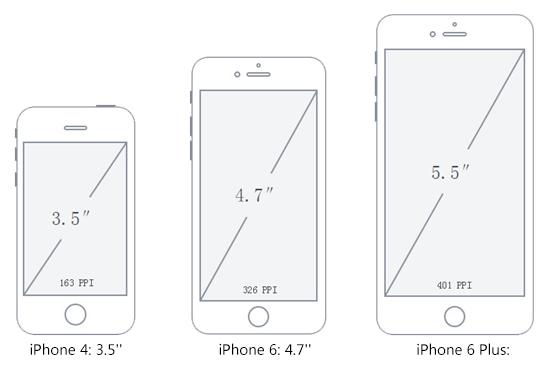
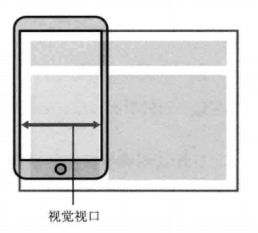

## 视口

### 屏幕

#### 屏幕尺寸

设备屏幕尺寸是指屏幕的**对角线长度**。比如：iPhone6/7 是4.7寸，iPhone6/7p 是5.5寸。

```
1英寸 = 2.54厘米
3.5in = 3.5*2.54cm = 8.89cm
4.0in = 4.0*2.54cm = 10.16cm
4.8in = 4.8*2.54cm = 12.192cm
5.0in = 5.0*2.54cm = 12.7cm
5.5in = 5.5*2.54cm = 13.97cm
6.0in = 6.0*2.54cm = 15.24cm
```




#### 像素

像素是计算机屏幕能显示一种特定颜色的最小区域。

在移动 Web 应用中，像素分为设备像素和逻辑像素（也称为 CSS 像素）。

##### 设备像素

设备像素是物理概念，指的是设备中使用的物理像素，也就是屏幕中的发光的点数（屏幕由很多个发光点组成，每个发光点可以显示不同的颜色，这些发光的点组成了屏幕）。

比如 iPhone 5 的分辨率 `640x1136px`。横向有640个发光的点，纵向有1136个发光的点。所以我们说 iPhone5 的设备水平像素是640像素，指的是640个发光点。

##### 逻辑像素

逻辑像素是 Web 编程的概念，CSS 样式代码中使用的正是逻辑像素。1个逻辑像素可能对应多个物理像素（设备发光点）。

在 CSS 规范中，长度单位可以分为两类，绝对（absolute）单位以及相对（relative）单位。`px` 是一个相对单位，相对的是设备像素（Device Pixel）。

在 Apple 的视网膜屏（Retina）中，每 4 个（设备）像素为一组，渲染出普通屏幕中一个像素显示区域内的图像，从而实现更为精细的显示效果。此时， 250px 的（逻辑像素的）元素跨越了 500 个物理像素的宽度。


浅显的理解就是可以看作是 `2cmx2cm` 的正方形被切割成四块，然后遇到 dpr 为2的时候，被切割的四块又被分别切割成四块，但是总面积不变。

如果用户进行了放大，那么一个 CSS 像素还将跨越更多的物理像素。

##### 设备的独立像素

设备独立像素（DIP，Device Independent Pixel，Density Independent Pixel），简单地来说设备独立像素就是：独立于设备的用于逻辑上衡量像素的单位。**在移动Web开发中就是指的CSS的逻辑像素**。

#### 分辨率

屏幕分辨率（Resolution）是指：**屏幕的像素点数**。

- 在 PC 端的分辨率常见是：`[ 1366*768, 1440*900, 1024*768, 1400*900,...]`
- 移动端常见分辨率: `[2160*1080, 1920*1080, 1334*750, 1136*640...]`

在说分辨率的时候我们常常会把大的值说在前面，所以在 PC 端屏幕宽度比高度的值要大一点，第一个值一般是指的宽度，第二个值为高度。

移动端正好相反，手机一般宽度都是小于高度，所以第一个值是宽度。

补充几个概念：

* Full HD（全高清）：`1920*1080` 分辨率，iPhone7p 就是这个。

* 4K屏：也叫 QHD 或 UHD（超高清），最小分辨率是 `3840*2160`，电视用得多

* 设备相机的像素：
  * `640*480` = 307200 = 30万像素

  * `1600*1200` = 1920000 = 200万像素

  * `3264*2488` = 8120832 = 800万像素

  * `4536*3024` = 13716864 = 1400万像素

#### 设备像素密度

PPI（Pixels Per Inch）表示每英寸所拥有的像素数目，即像素密度（Screen Density）。

一般的计算方法或者公式： **PPI = 对角线分辨率 / 屏幕尺寸（英寸）**

屏幕对角线的分辨率也就是屏幕对角线上的像素点数，可以根据已知的横纵分辨率通过勾股定理计算得。

[DPI 和 PPI 的区别是什么?](https://www.zhihu.com/question/23770739)

DPI 通常用于打印机，而 PPI 多用于显示器。

#### 设备像素比

设备像素比是默认缩放为100%的情况下，物理像素和 CSS 像素的比值。

```
DPR = 物理像素数 / 逻辑像素数
```

>  MacBook Pro 视网膜屏（Retina）显示器硬件像素是 `2880px *1800px`。当设置屏幕分辨率为 `1920px * 1200px` 的时候，理想视口的宽度值是 1920px， 那么 DIP 的宽度值就是 1920px。其与理想视口宽度的比值为1.5（2880/1920），这个比值叫做设备像素比。

设备像素比可以通过 `window.devicePixelRatio` 来获取，或者使用 CSS 中的 `device-pixel-ratio`。

设备像素比不一定都是整数，尤其是 Android 设备十分的碎片化。

下面常见的设备像素比：

- 普通密度桌面显示屏：`devicePixelRatio = 1`
- 高密度桌面显示屏（Retina）：`devicPixelRatio = 2 `
- 主流手机显示屏：`devicePixelRatio = 2 or 3`

对于一张 `100px*100px` 的图片，通过 CSS 设置其宽高：

```css
{
    width: 100px;
    height: 100px;
}
```

在普通显示屏的电脑中打开是正常的，但假设在手机或 Retina 屏中打开，按照逻辑分辨率来渲染，他们的 `deviceRatio = 2`，那么就相当于拿4个物理像素来描绘1个电子像素。这等于拿一个2倍的放大镜去看图片，图片就会变得模糊。

这时，就需要使用 `@2x` 甚至 `@3x` 图来避免图片的失真。

**1px的物理像素的解决方案**

从第一部分的讨论可知 viewport 的 `initial-scale` 具有缩放页面的效果。对于 dpr=2 的屏幕，1px压缩一半便可与1px的设备像素比匹配，这就可以通过将缩放比 `initial-scale` 设置为 0.5=1/2 而实现。以此类推 dpr=3的屏幕可以将 `initial-scale` 设置为 0.33=1/3 来实现。

 ### 视口

在 PC 端，视口指的是浏览器的可视区域，其宽度和浏览器窗口的度保持一致。在 CSS 标准文档中，视口也被称为初始包含块，它是所有 CSS 百分比宽度推算的根源，给 CSS 布局限制了一个最大宽度。

移动端浏览器通常宽度是 `240px~640px`，而大多数为 PC 端设计的网站宽度至少为 800px，如果仍以浏览器窗口作为视口的话，网站内容在手机上看起来会非常窄。

因此，移动端引入三个概念，使得移动端中的视口与浏览器宽度不再相关联。

* 布局视口 Layout Viewport
* 视觉视口 Visual Viewport
* 理想视口 Ideal Viewpor

#### 布局视口

一般移动设备的浏览器都默认设置了一个 `<viewport>` 元标签，定义一个虚拟的布局视口（Layout Viewport），用于解决早期的页面在手机上显示的问题。iOS 和 Android 基本都将这个视口分辨率设置为 980px，所以 PC 上的网页基本能在手机上呈现，只不过元素看上去很小，一般默认可以手动缩放网页。


布局视口的宽度 / 高度可以通过 `document.documentElement.clientWidth/clientHeight` 获取。

可以看到，默认的布局视口宽度为 980px。如果要显式设置布局视口，可以使用 HTML 中的 `<meta>` 标签：

```html
<meta name="viewport" content="width=400">
```

布局视口使视口与移动端浏览器屏幕宽度完全独立开。CSS 布局将会根据它来进行计算，并被它约束。

我们可以使用视口标签（Viewport `<meta>` 标签）来显式地设置布局视口。

```html
<meta name="viewport" content="width=device-width,initial-scale=0,maximum-scale=1,user-scalable=no">
```

下面是每个属性的详细说明：

| 属性名        | 取值                     | 描述                                                    |
| ------------- | ------------------------ | ------------------------------------------------------- |
| width         | 正整数或 `device-width`  | 定义视口的宽度，单位为像素                              |
| height        | 正整数或 `device-height` | 定义视口的高度，单位为像素，一般不用                    |
| initial-scale | [0.0-10.0]               | 定义初始缩放值                                          |
| minimum-scale | [0.0-10.0]               | 定义放大最大比例，它必须小于或等于 `maximum-scale` 设置 |
| maximum-scale | [0.0-10.0]               | 定义缩小最小比例，它必须大于或等于 `minimum-scale` 设置 |
| user-scalable | yes / no                 | 定义是否允许用户缩放页面，默认 yes                      |

有几点值得注意：

- `<viewport>` 标签只对移动端浏览器有效，对 PC 端浏览器无效
- 当缩放比例为100%时，`dip 的宽度 = CSS像素宽度 = 理想视口的宽度 = 布局视口的宽度`
- 单独设置 `initial-scale` 或 `width` 都会有兼容性问题，所以设置布局视口为理想视口的最佳方法是同时设置这两个属性
- 即使设置了 `user-scalable = no`，在 Android Chrome 浏览器中也可以强制启用手动缩放

如果 `布局视口的宽度 = device-width`（设备宽度，也就是：`物理像素/dpr`）时，此时页面100%的宽度正好能在视觉视口中完全显示，不需要缩放查看页面了，而且在不同尺寸下都能基本表现一致，此时的布局视口的状态我们就称为**理想视口（Ideal Viewport）**。 

#### 视觉视口

视觉视口是用户当前看到的区域，用户可以通过缩放操作视觉视口，同时不会影响布局视口。



视觉视口和缩放比例的关系为：`当前缩放值 = 理想视口宽度  / 视觉视口宽度`

所以，当用户放大时，视觉视口将会变小，CSS 像素将跨越更多的物理像素。

#### 理想视口

布局视口的默认宽度并不是一个理想的宽度，于是 Apple 和其他浏览器厂商引入了理想视口的概念，它对设备而言是最理想的布局视口尺寸。显示在理想视口中的网站具有最理想的宽度，用户无需进行缩放。

理想视口的值其实就是屏幕分辨率的值，它对应的像素叫做设备逻辑像素（Device Independent Pixel，DIP）。DIP 和设备的物理像素无关，一个 DIP 在任意像素密度的设备屏幕上都占据相同的空间。如果用户没有进行缩放，那么一个 CSS 像素就等于一个 DIP。

理想视口的宽度一般可以通过以下公式计算： `理想视口的宽度 = 设备像素 / dpr`

也就是当**布局视口的宽度**等于**设备独立像素的宽度**时就是理想视口。

用下面的方法可以使布局视口与理想视口的宽度一致：

```html
<!-- 这行代码告诉浏览器,布局视口的宽度应该与理想视口的宽度一致 -->
<meta name="viewport" content="width=device-width">
```

实际上，这就是响应式布局的基础。

#### 实际应用

以下是通过改变 meta viewport 的几个参数的值来算取不同的 viewport：

| width        | initial-scale | layout viewport | visual viewport | ideal viewport | 是否滚动 |
| ------------ | ------------- | --------------- | --------------- | -------------- | -------- |
| -            | -             | 980px           | 980px           | 375px          | no       |
| device-width | 1             | 375px           | 375px           | 375px          | no       |
| device-width | 2             | 375px           | 188px           | 375px          | yes      |
| device-width | 0.5           | 750px           | 750px           | 375px          | no       |
| 480px        | 1             | 480px           | 375px           | 375px          | yes      |
| 480px        | 2             | 480px           | 188px           | 375px          | yes      |
| 480px        | 0.5           | 750px           | 750px           | 375px          | no       |

以上是针对 iPhone 6/7/8 的测试数据，且无论怎么设置 Viewport 都具有临界值，即：`75 <= layoutviewport <= 10000`，`75 <= visualviewport <= 1500`。

**为什么要设置 Viewport？**

viewport 的设置不会对 PC 页面产生影响，但对于移动页面却很重要。下面我们举例来说明：

1. 媒体查询 `@media` 响应式布局中，会根据媒体查询功能来适配多端布局，必须对 viewport 进行设置，否则根据查询到的尺寸无法正确匹配视觉宽度而导致布局混乱。如不设置 viewport 参数，多说移动端媒体查询的结果将是 980px 这个节点布局的参数，而非我们通常设置的 768px 范围内的这个布局参数
2. 由于目前多数手机的 DPR 都不再是 1，为了产出高保真页面，我们一般会给出 750px 的设计稿，那么就需要通过设置 viewport 的参数来进行整体换算，而不是在每次设置尺寸时进行长度的换算。

### 概念关系图

```
屏幕尺寸、屏幕分辨率 ==> 对角线分辨率/屏幕尺寸 ==> 屏幕像素密度PPI
                                                 |
                  设备像素比dpr = 物理像素 / 设备独立像素dip(dp)
                                                 |
                                           viewport: scale
                                                 |
                                              CSS像素px
```

---

参考资料：

- [移动前端开发之 Viewport 的深入理解](https://www.cnblogs.com/2050/p/3877280.html)
- [移动端适配总结](https://juejin.im/post/5c0dd7ac6fb9a049c43d7edc)

