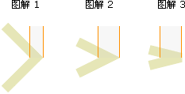

## 线型 Line styles

绘制线段的相关样式属性及方法共有七种：

- [lineWidth](#linewidth)
- [lineCap](#linecap)
- [lineJoin](#linejoin)
- [miterLimit](#miterlimit)
- [getLineDash()](#getlinedash)
- [setLineDash()](#setlinedash)
- [lineDashOffset](#linedashoffset)

### lineWidth

`CanvasRenderingContext2D.lineWidth` 属性设置或返回当前线条的宽度，以像素计。

#### 语法

```js
context.lineWidth = value
```

| 值    | 说明                                                       | 类型   |
| ----- | ---------------------------------------------------------- | ------ |
| value | 描述线段宽度的值。0、负数、`Infinity` 和 `NaN ` 会被忽略。 | number |

#### 示例

```html
<canvas id="canvas"></canvas>
```

```js
var canvas = document.getElementById("canvas");
var ctx = canvas.getContext("2d");

ctx.beginPath();
ctx.moveTo(0,0);

// 设置线段宽度
ctx.lineWidth = 15;

ctx.lineTo(100, 100);
ctx.stroke();
```

### lineCap

`CanvasRenderingContext2D.lineCap` 指定绘制线段末端的样式属性。

#### 语法

```js
context.lineCap = "butt" || "round" || "square";
```

| 值     | 说明                                                         | 类型   |
| ------ | ------------------------------------------------------------ | ------ |
| butt   | 向线条的每个末端添加平直的边缘。默认值。                     | string |
| round  | 向线条的每个末端添加圆形线帽。                               | string |
| square | 向线条的每个末端添加正方形线帽，但是增加了一个宽度和线段相同，高度是线段厚度一半的矩形区域。 | string |

#### 示例

```html
<canvas id="canvas"></canvas>
```

```js
var canvas = document.getElementById("canvas");
var ctx = canvas.getContext("2d");

ctx.beginPath();
ctx.moveTo(0,0);
ctx.lineWidth = 15;

// 设置线段末端样式属性
ctx.lineCap = "round";

ctx.lineTo(100, 100);
ctx.stroke();
```

### lineJoin

`CanvasRenderingContext2D.lineJoin` 属性设置或返回所创建边角的类型，当两条线交汇时。


#### 语法

```js
context.lineJoin = "bevel" || "round" || "miter";
```

| 值     | 说明                                                         | 类型   |
| ------ | ------------------------------------------------------------ | ------ |
| round  | 通过填充一个额外的，圆心在相连部分末端的扇形，绘制拐角的形状。圆角的半径是线段的宽度。圆角。 | string |
| bevel  | 在相连部分的末端填充一个额外的以三角形为底的区域，每个部分都有各自独立的矩形拐角。斜角。 | string |
| minter | 通过延伸相连部分的外边缘，使其相交于一点，形成一个额外的菱形区域。这个设置可以通过 `minterLimit` 属性看到效果。尖角。 | string |

#### 示例

```html
<canvas id="canvas"></canvas>
```

```js
const canvas = document.getElementById("canvas");
const ctx = canvas.getContext("2d");

ctx.lineWidth = 10;

// 设置线段相交处样式属性
ctx.lineJoin = "round";

ctx.beginPath();
ctx.moveTo(0,0);
ctx.lineTo(200, 100);
ctx.lineTo(300,0);
ctx.stroke();
```

### miterLimit

`CanvasRenderingContext2D.miterLimit` 属性设置或返回最大斜接长度。当给属性赋值时，0、负数、`Infinity` 和 `NaN` 都会被忽略，除此之外都会被赋予一个新值。

斜接长度指的是在两条线交汇处内角和外角之间的距离。


只有当 `lineJoin` 属性为 `"miter"` 时，`miterLimit` 才有效。

边角的角度越小，斜接长度就会越大。

为了避免斜接长度过长，我们可以使用 `miterLimit` 属性。

如果斜接长度超过 `miterLimit` 的值，边角会以` lineJoin` 的 `"bevel"` 类型来显示（图解 3）：



#### 语法

```js
context.minterLimit = value;
```

| 值    | 说明                 | 类型   |
| ----- | -------------------- | ------ |
| value | 斜接面限制比例的值。 | string |

### getLineDash()

`CanvasRenderingContext2D.getLineDash` 用以获取当前线段样式的方法。

#### 语法

```js
context.getLineDash();
```

返回值：一个 `Array` 数组。一组描述交替绘制线段和间距（坐标空间单位）长度的数字。如果数组元素的数量是奇数，数组元素会被复制并重复。

#### 示例

```html
<canvas id="canvas"></canvas>
```

```js
var canvas = document.getElementById("canvas");
var ctx = canvas.getContext("2d");

ctx.setLineDash([5, 15]);

// 获取线段样式
console.log(ctx.getLineDash());		// [5, 15]

ctx.beginPath();
ctx.moveTo(0,100);
ctx.lineTo(400, 100);
ctx.stroke();
```

### setLineDash()

`CanvasRenderingContext2D.getLineDash` 用以设置当前虚线样式的方法。

#### 语法

```js
context.setLineDash(segments)
```

| 参数     | 说明                                                         | 类型     |
| -------- | ------------------------------------------------------------ | -------- |
| segments | 一组描述交替绘制线段和间距（坐标空间单位）长度的值。 如果数组元素的数量是奇数， 数组的元素会被复制并重复。 | number[] |

#### 示例

```html
<canvas id="canvas"></canvas>
```

```js
const canvas = document.getElementById("canvas");
const ctx = canvas.getContext("2d");

// 设置线段样式
ctx.setLineDash([5, 15]);

ctx.beginPath();
ctx.moveTo(0,100);
ctx.lineTo(400, 100);
ctx.stroke();
```

### lineDashOffset

`CanvasRenderingContext2D.lineDashOffset` 用以设置虚线偏移量的属性。

#### 语法

```js
context.lineDashOffset = value
```

| 值    | 说明                            | 类型   |
| ----- | ------------------------------- | ------ |
| value | 虚线偏移量，为 float 精度的数值 | number |

#### 示例

```html
<canvas id="canvas"></canvas>
```

```js
const canvas = document.getElementById("canvas");
const ctx = canvas.getContext("2d");

ctx.setLineDash([4, 16]);

// 设置虚线偏移量属性
ctx.lineDashOffset = 2;

ctx.beginPath();
ctx.moveTo(0,100);
ctx.lineTo(400, 100);
ctx.stroke();
```