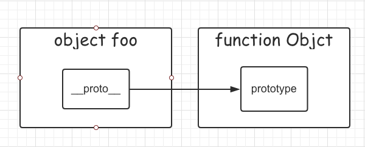
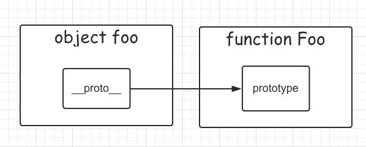
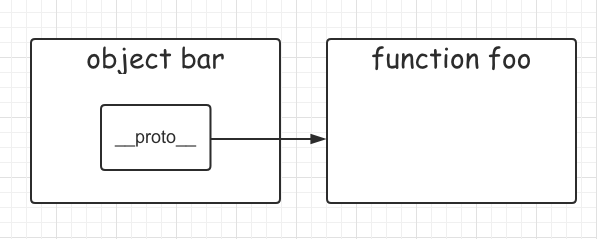
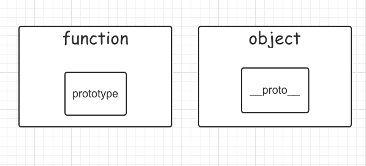

## 原型链

ECMAScript 中描述了原型链的概念，并将原型链作为实现继承的主要方法。其基本思想是利用原型让一个引用类型继承另一个引用类型的属性和方法。

### 原型和原型链

JavaScript 中的对象，都有一个内置属性 `[[Prototype]]` ，指向这个对象的原型对象。

当查找一个对象属性或方法时，如果在当前对象中找不到定义，会继续在当前对象的原型对象中查找。如果原型对象中依然没有找到，会继续在原型对象的原型中查找（原型也是对象，也有它自己的原型）；依次类推，直到找到为止，或者查找到最顶层的原型对象（`Object.prototype`），就结束查找，返回 `undefined`。

整个查找过程中，从当前对象出发沿着原型对象（`[[Prototype]]`）构成的链条查找相关属性和方法，而这些链接对象的整个链条就是**原型链**。

📌 在浏览器中，JavaScript 对象的内置属性 `[[Prototype]]` 以 `__proto__` 表示。

🌰 **示例：原型链示例**

```js
const Foo = function(){}

const foo = new Foo()

console.log(foo.__proto__)  // Foo {} 构造器 function Foo 的原型对象

console.log(foo.__proto__.__proto__)  // Object {} 构造器 function Object 的原型对象

console.log(foo.__proto__.__proto__.__proto__)  // null
```

区别于的是在原型链中查找属性或方法，没有查找到相关属性或方法，返回的是 `undefined` 表示原型链中没有该属性或方法。而通过访问原型链中的原型对象，到达原型链终点，即 `Object.prototype` 的值为 `null`。

### 原型对象

`__proto__` 的指向取决于对象创建时的实现方式。

#### 字面量方式

当通过字面量方式创建对象时，它的原型就是 `Object.prototype`。虽然我们无法直接访问内置属性 `[[Prototype]]`，但我们可以通过 `Object.getPrototypeOf()` 或对象的属性 `__proto__` 获取对象的原型。

```js
const foo = {}

console.log(foo.__proto__ === Object.prototype) // true
console.log(Object.getPrototypeOf(foo) === Object.prototype) // true
```



#### 构造器方式

```js
const Foo = function(){}

const foo = new Foo()

console.log(foo.__proto__ === Foo.prototype) // true
console.log(Object.getPrototypeOf(foo) === Foo.prototype) // true
```



#### Object.create() 方式

通过 `Object.create()` 方式创建的对象会以传入的对象参数为对象的原型。

```js
const foo = {}

const bar = Object.create(foo)

console.log(bar.__proto__ === foo)
```



### 显示原型和隐式原型的区别

我们把 `prototype` 称作显式原型，`[[Prototype]]` 称作隐式原型。

* 显示原型的作用：用来实现基于原型的继承与属性的共享。
* 隐式原型的作用：构成原型链，同样用于实现基于原型的继承。



* `prototype` 是**函数**才有的属性
* `[[Prototype]]`（ `__proto__` ）是每个**实例对象**都有的属性
  * 在 ECMAScript2015 中 `__proto__` 属性已经标准化
  * 因为 JavaScript 中函数也是对象，因此函数也有 `__proto__` 属性

> ⚠️ 注意：大多数情况下，`__proto__` 可以理解为“构造器的原型”
>
> 即 `__proto__ === constructor.prototype`（通过 `Object.create()` 创建的对象不适用此等式）

### instanceof

通过 `instanceof` 操作符可以确定原型与实例的关系。

```js
// 假设 instanceof 操作符左边是 L 右边是 R
L instanceof R

// instanceof 运算时 通过判断 L 的原型链是否存在 R.prototype
L.__proto__.__proto__... === R.prototype
```

⚠️ 注意：`instanceof` 操作符会递归查找 L 的原型链，即 `L.__proto__.__proto__.__proto__...` 知道找到了或者到达顶层为止。

构造器 Function 的构造器是它自身：

```js
Function.constructor === Function  // true
```

构造器 Object 的构造器是 Function（因此可得所有构造器的 constructor 都指向 Function）

```js
Object.constructor === Function  // true
```

构造器 Function 的 `[[Prototype]]` 是一个特殊的匿名函数

```js
console.log(Function.__proto__)  // function(){}
```

这个特殊的匿名函数的 `[[Prototype]]` 指向 Object 的 prototype 原型。

```js
Function.__proto__.__proto__ === Object.prototype  // true
```

Object 的 `[[Prototype]]` 指向 Function 的 prototype 也就是上述的特殊的匿名函数

```js
Object.__proto__ === Function.prototype    // true

Function.prototype === Function.__proto__  // true
```

内置对象 Function 和 Object 的关系：

```js
Function instanceof Object // true
Object instanceof Function // true
```

其他标准内置对象的字面量原型链关系：

```js
console.log((true).__prto__.__proto__ === Object.prototype)

console.log((123).__proto__.__proto__ === Object.prototype)

console.log(('String').__proto__.__proto__ === Object.prototype)

console.log(([]).__proto__.__proto__ === Object.prototype)

console.log(({}).__proto__ === Object.prototype)
```

**总结：**

* 所有的构造器的 constructor 都指向 Function
* Function 的 prototype 指向一个特殊匿名函数，而这个特殊匿名函数的 `__proto__` 指向 Object.prototype

---

**参考资料：**

* [JS原型链图解教程](object-oriented-programming/object-understand/)